# Wardora App / 微信小程序跨端问题完整审计与解决方案

> 审计日期：2026-07-12
> 审计对象：主 App、微信小程序、线上登录链路
> App 基线：main，HEAD 9b300057
> 小程序基线：wechat/miniprogram，HEAD 62e35eb
> 文档状态：只读诊断与执行方案；本文件不代表代码问题已经修复

## 1. 结论先行

两轮反馈共归并为 17 个用户可见问题、9 组根因和 4 个新增录入问题。优先级如下：

| 优先级 | 问题 | 结论 |
| --- | --- | --- |
| P0 | 小程序微信登录 | 线上服务进程没有读取到微信小程序 Secret；不是普通 UI 错误 |
| P0 | App 后台恢复图片失败 | 图片 URL 清理、未结束请求和重试入口存在生命周期竞态 |
| P0/P1 | App 单品/种草详情不能滚动 | 共享详情壳的动态视口高度与外层安全区/变换容器冲突 |
| P1 | 小程序录入源按钮、缩略图操作、裁切 | 录入 Step 1 没有完全复用 App 的交互和视觉基线 |
| P1 | 小程序计划、周历/月历、导航、确认框 | 同日计划语义和共享 UI 基建没有收口 |
| P1 | 设置、诊断、AI 建议 | 小程序正式分支与已完成能力存在集成漂移 |
| P1 | 账号安全 | 需要新增服务端认证挑战与两端完整 UI，不是单页改字 |
| P1 | App 添加单品/种草/套装上下大面积空白 | Android 原生 inset 物理像素直接写入 CSS 像素，疑似造成顶部和底部安全区被放大 |

新增问题中，App 的截图已经提供了正确参考：App 的录入入口有 SVG 图标，选中缩略图后操作气泡位于缩略图上方，气泡箭头指向缩略图顶部中心，裁切器提供“自由”和“3:4”两种比例。小程序应复用这一交互契约，而不是继续依赖微信原生裁切页。

## 2. 证据范围和限制

本审计使用了：

1. 用户本轮新增的 9 张截图。
2. 用户上一轮提供的 15 张截图。
3. App main 和小程序正式基线的源码、UI 规范、组件实现。
4. 线上 API 的只读健康检查和微信登录错误分支验证。

截图能够证明布局、文案、状态、视觉层级、按钮位置和明显的溢出。截图不能单独证明触摸命中、系统返回键、网络重连、Android 生命周期、验证码安全性或完整的无障碍合规；这些内容必须按本文末尾的验收清单做真实设备验证。

红色手绘圈和箭头是用户批注，不是产品 UI。

### 2.1 审计步骤与总体健康度

| 步骤 | 流程/界面 | 总体健康度 |
| ---: | --- | --- |
| 1 | 小程序微信登录 | Broken / P0 |
| 2 | 登录、注册协议勾选 | Broken / P1 |
| 3 | 衣橱多选操作栏 | Broken / P1 |
| 4 | 业务删除/退出确认 | Broken / P1 |
| 5 | 计划详情编辑/删除 | Broken / P1 |
| 6 | 日历多计划、周历/月历 marker、空状态 CTA | Needs correction / P1 |
| 7 | 小程序图标、底栏、FAB | Broken / P1 |
| 8 | 账号安全 | Incomplete / P1 |
| 9 | 设置、画像、远程诊断 | Incomplete / P1 |
| 10 | 小程序单品/种草详情与 AI 建议 | Broken / P1 |
| 11 | App 后台恢复图片 | Broken / P0 |
| 12 | App 单品/种草详情滚动 | Broken / P0/P1 |
| 13 | 小程序拍照/图库入口 | Broken / P1 |
| 14 | 小程序选图后缩略图操作气泡 | Broken / P1 |
| 15 | 小程序自由/3:4 裁切 | Broken / P1 |
| 16 | App 单品/种草/套装录入页有效视口 | Broken / P1 |

## 3. UI 规范基线

本方案以 [wardrobe-ui-spec.md](/Users/fangzheng/Documents/衣柜识别+根据要去的地方和活动自动搭配穿搭的APP/docs/designs/wardrobe-ui-spec.md) 为唯一 UI 事实源，关键约束如下：

| 规范 | 本次使用方式 |
| --- | --- |
| 图片默认竖向 3:4 | 单品、种草、录入裁切器和缩略图默认采用 3:4 |
| 一级/二级卡片同心圆角 | 录入源按钮、缩略图气泡和裁切面板沿用现有卡片关系 |
| 危险色 | 删除、清空、不可恢复操作使用 color.danger = #dc2626；不要用蓝色表示删除确认 |
| 录入流程 | 用户只看到两步：选择照片、确认信息；裁切属于 Step 1 子状态 |
| Step 1 顶部 | 透明底 + 毛玻璃，不绘制实心白条 |
| 图片来源入口 | 使用圆角矩形、左侧语义 SVG 图标槽，不使用无图标的大白卡 |
| 触控 | 图标按钮保留至少 44px 等效命中区；窄屏不得横向滚动 |
| 底部导航 | 白色毛玻璃圆角矩形，选中项为同心圆角色块，不使用圆形 tab 激活态 |
| 文字 | 气泡操作文案单行显示；按钮写结果，不使用模糊的“确定” |

规范中的录入流程和 Step 1 要求见 [录入状态机](/Users/fangzheng/Documents/衣柜识别+根据要去的地方和活动自动搭配穿搭的APP/docs/designs/wardrobe-ui-spec.md:323)、[录入入口规则](/Users/fangzheng/Documents/衣柜识别+根据要去的地方和活动自动搭配穿搭的APP/docs/designs/wardrobe-ui-spec.md:352)；危险色见 [颜色 token](/Users/fangzheng/Documents/衣柜识别+根据要去的地方和活动自动搭配穿搭的APP/docs/designs/wardrobe-ui-spec.md:48)。

## 4. 新增问题：小程序录入图片入口

### 4.1 源按钮重合、过大、缺少矢量图标

健康度：Broken，P1。

证据：

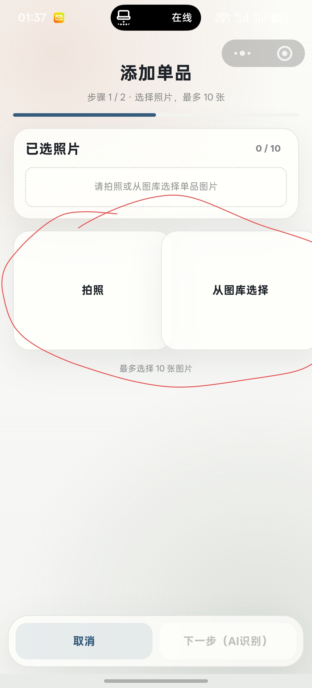

截图中“拍照”和“从图库选择”两个大卡片几乎贴在一起，卡片高度远大于信息量，按钮内部没有语义图标。正式分支对应实现位于：

- [小程序录入 WXML](/Users/fangzheng/Documents/wardrobe-wechat-miniprogram/apps/wechat-miniprogram/pages/intake/camera/index.wxml:30)
- [小程序录入样式](/Users/fangzheng/Documents/wardrobe-wechat-miniprogram/apps/wechat-miniprogram/pages/intake/camera/index.wxss:41)

当前样式使用两列 1fr、最小高度 288rpx，WXML 只有文字，没有图标。问题不是业务按钮点击逻辑，而是入口组件没有采用规范中的“图标槽 + 圆角矩形”模式。

App 已提供正确参考：

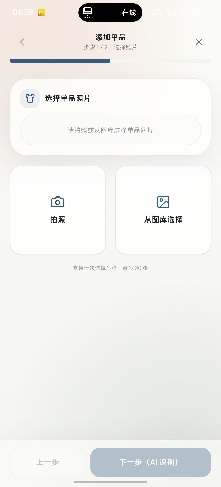

修复方案：

1. 新建小程序共享组件 MiniIntakeSourceButton，单品和种草共用。
2. 每个按钮包含固定 SVG 图标槽、标题和可选副文案；空状态只显示“拍照”“从图库选择”，已有图片时显示“继续拍照”“继续从图库选择”。
3. 宽度使用 minmax(0, 1fr)，卡片使用 border-box，保持至少 24rpx 间距；不得依赖微信 button 默认外边距。
4. 空状态按钮高度收敛到内容所需的范围，不再使用 288rpx 的大面积空白卡。
5. SVG 图标使用 Camera 和 Image 来源的矢量资产，不能使用文字符号或 PNG；图标和文字都必须可读，图标不是唯一信息来源。
6. 360/390/430 宽度分别检查，按钮文字不得换行、互相覆盖或被底部操作栏遮挡。

### 4.2 选图后操作放在缩略图下方，未复用 App 气泡

健康度：Broken，P1。

证据：

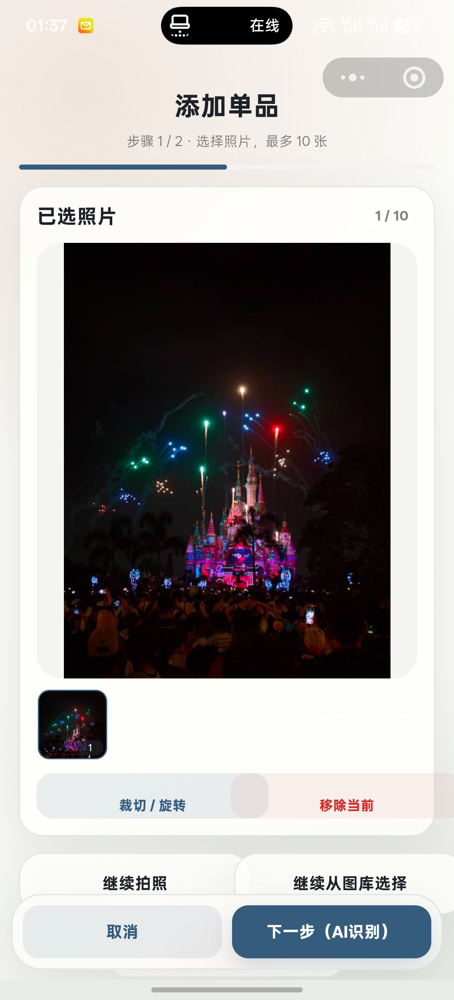

小程序当前把“裁切 / 旋转”和“移除当前”作为图片卡片下方的普通双列按钮，见：

- [小程序操作 WXML](/Users/fangzheng/Documents/wardrobe-wechat-miniprogram/apps/wechat-miniprogram/pages/intake/camera/index.wxml:24)
- [小程序操作样式](/Users/fangzheng/Documents/wardrobe-wechat-miniprogram/apps/wechat-miniprogram/pages/intake/camera/index.wxss:26)

App 的正确参考如下：

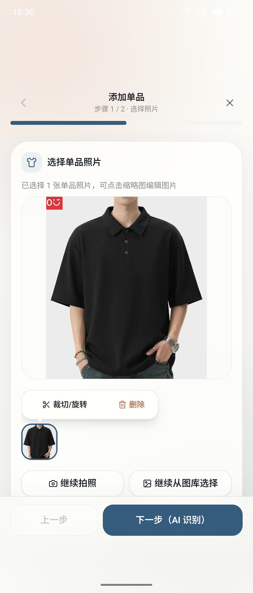

修复方案：

1. 删除小程序图片卡片下方的 image-actions 流式按钮。
2. photo-card 设置为定位边界，缩略图行外再放一层不裁切的 overlay layer；不要让横向滚动容器直接裁掉气泡。
3. 点击哪张缩略图，哪张缩略图成为 active，气泡立即显示在该缩略图正上方。
4. 气泡内固定两个单行操作：
   - SVG Scissors：裁切 / 旋转
   - SVG Trash2：删除
5. 气泡宽度固定或有上限，文字使用 white-space: nowrap；小屏不能缩成两行。
6. 气泡左边界不得超过一级 photo-card 左边缘，右边界不得超过一级 photo-card 右边缘。
7. 箭头必须指向当前缩略图顶部中心。计算逻辑与 App 的 ThumbnailActionPopover 一致：
   - bubbleLeft = clamp(selectedCenter - bubbleWidth / 2, cardLeft, cardRight - bubbleWidth)
   - arrowLeft = selectedCenter - bubbleLeft，并限制在气泡内安全范围
8. photo-card 必须 overflow: visible；缩略图横向滚动只作用于 thumbnail strip，不作用于气泡层。
9. 删除动作使用 #dc2626 及轻量危险色背景；气泡操作命中区不小于 44px 等效尺寸。
10. 选择第一张、中间一张、最后一张，以及横向滚动后再选择，分别检查边界和箭头。

### 4.3 小程序原生裁切没有自由比例和 3:4 选择

健康度：Broken，P1。

证据：

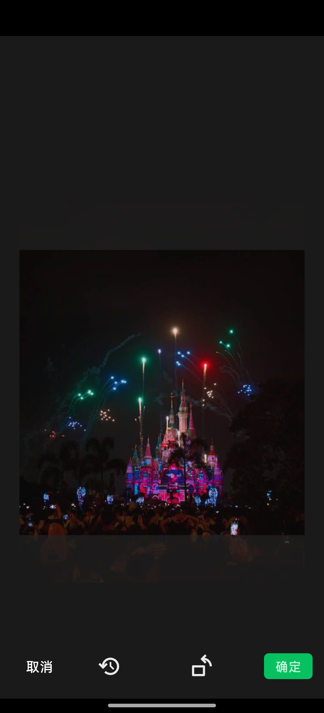

小程序当前直接调用原生裁切：

- [原生裁切调用](/Users/fangzheng/Documents/wardrobe-wechat-miniprogram/apps/wechat-miniprogram/services/assets.ts:103)

当前 wrapper 没有传 cropScale，页面也没有比例选择、旋转按钮、重置按钮或与 App 对齐的裁切层。App 参考实现如下：

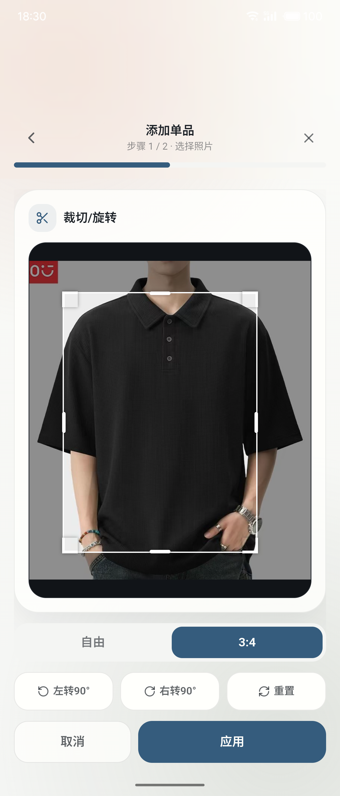

App 的裁切器已经实现：

- 自由比例和 3:4 切换
- 白色裁切框、四角把手、四边中点把手
- 旋转、重置、取消、应用
- 归一化 cropBox
- 从原图生成裁切结果

对应实现见 [App 裁切器比例选项](/Users/fangzheng/Documents/衣柜识别+根据要去的地方和活动自动搭配穿搭的APP/src/components/image-crop-editor.tsx:421) 和 [App 录入裁切子状态](/Users/fangzheng/Documents/衣柜识别+根据要去的地方和活动自动搭配穿搭的APP/src/components/garment-intake-flow.tsx:1108)。

建议方案：小程序实现自己的 MiniImageCropEditor，单品、种草、试穿参考照和详情重新裁切共用。

组件行为：

1. 以当前原图为唯一输入，图片只保留在当前页面会话内。
2. 画布上叠加半透明遮罩和裁切框。
3. 比例控制固定为“自由”“3:4”，默认 3:4。
4. 自由模式下四角和四边可独立拖动；3:4 模式锁定宽高比。
5. 支持左转 90°、右转 90°、重置、取消、应用。
6. 应用后返回归一化 x/y/width/height、旋转后的临时图片路径和 cropRevision。
7. 使用 canvas 生成临时裁切文件，再进入现有上传和服务器资产会话；不写入本地业务缓存。
8. 裁切框把手保留足够触摸面积，不能只提供 1px 细线命中。
9. 原生 wx.cropImage 可以作为固定比例失败时的降级路径，但不能作为自由比例的正式实现；正式 UI 必须走自绘组件，避免不同微信版本的原生页样式漂移。
10. 真机验证需覆盖竖图、横图、超长图、旋转后再裁切、切换比例后再拖动、取消和应用。

官方 API 链接保留在方案中供真机复核：[wx.cropImage](https://developers.weixin.qq.com/miniprogram/dev/api/media/image/wx.cropImage.html)。

### 4.4 App 添加单品、种草、套装页面上下大面积空白

健康度：Broken，P1；疑似 Android edge-to-edge inset 换算问题。

证据：

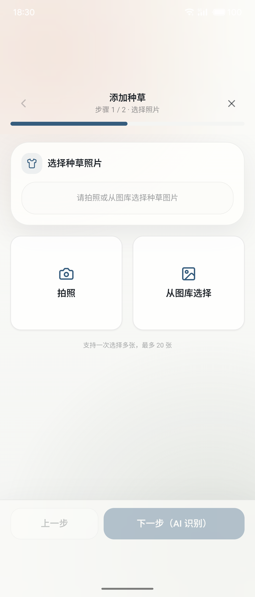

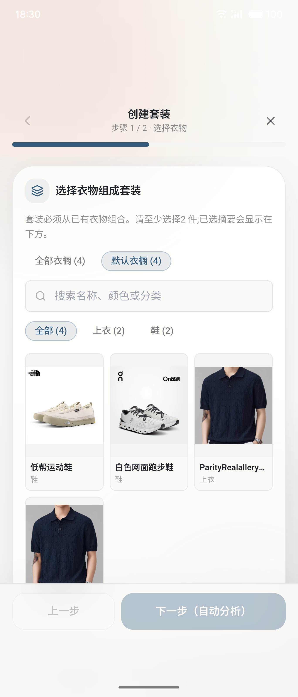

三类流程都共用 IntakeFlowShell，因此这是共享壳问题，不应分别给单品、种草和套装增加页面级负 margin。

关键代码：

- [Android 写入安全区变量](/Users/fangzheng/Documents/衣柜识别+根据要去的地方和活动自动搭配穿搭的APP/android/app/src/main/java/com/wardrobe/outfit/MainActivity.java:42)
- [Android inset 注入 JS](/Users/fangzheng/Documents/衣柜识别+根据要去的地方和活动自动搭配穿搭的APP/android/app/src/main/java/com/wardrobe/outfit/MainActivity.java:50)
- [录入壳顶部 padding](/Users/fangzheng/Documents/衣柜识别+根据要去的地方和活动自动搭配穿搭的APP/src/components/intake-flow-shell.tsx:124)
- [录入壳底部安全区与操作栏](/Users/fangzheng/Documents/衣柜识别+根据要去的地方和活动自动搭配穿搭的APP/src/components/intake-flow-shell.tsx:183)

根因假设：

- Android WindowInsetsCompat 返回的是原生物理像素。
- MainActivity 直接把 topPx/bottomPx 作为 CSS px 写进 WebView。
- WebView CSS 像素与 Android 原生物理像素并非同一单位，导致顶部和底部 inset 被放大。
- IntakeFlowShell 又叠加 env(safe-area-inset-top/bottom)，形成双重安全区。

修复方案：

1. 在 Android 原生层把物理像素按 displayMetrics.density 换算成 WebView CSS 使用的等效单位，或统一改为由 WebView safe-area 环境变量提供。
2. 明确只保留一个安全区来源：原生注入值与 env 值不能对同一边重复相加。
3. 记录运行时计算值，检查 390 宽设备上的 header 实际 padding、footer 实际高度和 WebView viewport。
4. IntakeFlowShell 主内容保持 min-h-0 flex-1，内容从标题下方自然开始；底部只为真实 footer 高度预留空间。
5. 修复 inset 后再看页面是否仍有业务内容空白；不要先添加负 margin 或压缩卡片。
6. 录入 Step 1、裁切子状态、Step 2 确认信息和创建套装逐页测量上下边界。

## 5. 前两轮问题合并方案

### 5.1 小程序微信登录失败：P0

线上只读验证中，health、ready、version 返回 200，但使用正确 AppID 和测试 code 请求微信登录返回 503 wechat_service_unavailable。按当前服务端分支，这对应生产进程没有读取到 WECHAT_MINIPROGRAM_APP_SECRET。

证据：

- [小程序错误映射](/Users/fangzheng/Documents/wardrobe-wechat-miniprogram/apps/wechat-miniprogram/pages/login/index.ts:6)
- [小程序微信登录请求](/Users/fangzheng/Documents/wardrobe-wechat-miniprogram/apps/wechat-miniprogram/services/auth.ts:63)
- [服务端 Secret 分支](/Users/fangzheng/Documents/衣柜识别+根据要去的地方和活动自动搭配穿搭的APP/services/wardrobe-api/src/auth/wechat-openid.ts:420)
- [ready 未检查微信配置](/Users/fangzheng/Documents/衣柜识别+根据要去的地方和活动自动搭配穿搭的APP/services/wardrobe-api/src/app.ts:100)

解决：生产 Secret 管理注入 AppID/Secret、重启服务、ready 增加配置门禁、用真实 wx.login code 验证首次绑定和重复登录；前端显示“微信登录暂不可用，仍可使用邮箱/手机号登录”，不要继续显示笼统维护文案。

### 5.2 三处勾选框过大：P1

三个页面直接使用微信原生 checkbox：

- [登录页](/Users/fangzheng/Documents/wardrobe-wechat-miniprogram/apps/wechat-miniprogram/pages/login/index.wxml:19)
- [密码登录页](/Users/fangzheng/Documents/wardrobe-wechat-miniprogram/apps/wechat-miniprogram/pages/login/password/index.wxml:23)
- [邮箱注册页](/Users/fangzheng/Documents/wardrobe-wechat-miniprogram/apps/wechat-miniprogram/pages/login/register-email/index.wxml:30)

抽成共享 AuthConsent。可见方框约 22–24rpx，外层命中区保留约 56–88rpx；协议文字和错误状态共用同一布局。

### 5.3 小程序多选操作栏出框：P1

问题来自 [小程序多选样式](/Users/fangzheng/Documents/wardrobe-wechat-miniprogram/apps/wechat-miniprogram/pages/wardrobe/index/index.wxss:293)：操作栏没有完整的 min-width、border-box 和窄屏约束。

解决：使用 minmax(0, 1fr) auto minmax(0, 1fr)，按钮宽度 100%，操作栏位于底栏之上，测试 360/390/430 宽和 1/5/10 个选中项。

### 5.4 小程序业务确认框禁止使用微信原生确认页：P1

当前正式分支仍有多处 wx.showModal 以及 wx.enableAlertBeforeUnload。业务确认统一换成项目 Sheet：

- 取消和危险结果按钮都必须存在。
- 删除文案写清影响范围，例如“删除 5 件衣物”。
- 删除、清空、退出未保存草稿使用 #dc2626 危险色。
- 系统权限、微信授权、系统级确认属于平台不可替换边界；业务确认不能再使用原生 showModal。

### 5.5 计划详情按钮与每日空状态：P1

计划详情的编辑/删除按钮来自 [计划详情操作区](/Users/fangzheng/Documents/wardrobe-wechat-miniprogram/apps/wechat-miniprogram/pages/trips/detail/index.wxml:38)，应使用可收缩的双操作栏。

当日和未来日期为空时统一显示“+计划穿搭”，过去日期可显示“补记穿搭”。计划详情进入时必须传递准确 planId。

### 5.6 同日多个计划与周历/月历统一：P1

数据库已有普通 userId/planDate 索引，没有日期唯一约束，允许同日多计划。问题在客户端部分逻辑把计划和穿搭只按日期或第一条计划处理。

解决：

- 所有穿搭归属使用 date + calendarPlanId。
- 同日多个计划时，日期入口先选择计划，计划详情入口直接绑定当前计划。
- 月历和周历最多显示两条 marker，排序规则一致。
- 小程序周历复用月历的 30rpx × 8rpx、间距 4rpx 和 tone 透明度。
- App 周历从现有 16px × 3px 改为与月历一致的 16px × 5px，并复用 PLAN_TONE_BG_MAP。

### 5.7 小程序图标、底栏和加号：P1

当前正式小程序仍使用原生 tabBar PNG，[app.json](/Users/fangzheng/Documents/wardrobe-wechat-miniprogram/apps/wechat-miniprogram/app.json:47)未启用 custom；项目已有未启用的自定义毛玻璃底栏，[custom-tab-bar 样式](/Users/fangzheng/Documents/wardrobe-wechat-miniprogram/apps/wechat-miniprogram/custom-tab-bar/index.wxss:2)可作为基础。

解决：

- 只保留一个底栏 owner，启用自定义 tabBar，清除原生 tabBar 缓存和重复渲染。
- 白色约 70–75% 透明度毛玻璃圆角矩形。
- 选中项使用同心圆角牛仔蓝色块。
- PNG 和文字加号全部替换为 SVG；所有 FAB 统一白色 Plus 图标和尺寸。
- 颜色不能依赖 SVG image 继承 currentColor，按语义生成 tone 版本。

### 5.8 账号安全：P1，全栈

当前两端只展示账号快照，现有认证契约没有完整的邮箱、手机号和微信换绑接口，见 [认证契约](/Users/fangzheng/Documents/衣柜识别+根据要去的地方和活动自动搭配穿搭的APP/packages/cloud-contracts/src/auth/contracts.ts:84)。

统一采用一次性重新验证挑战：

- 当前密码或当前邮箱验证码任选其一完成重新验证。
- 修改邮箱还需验证新邮箱。
- 绑定/换绑手机号还需验证新手机号。
- 修改密码后撤销其他会话。
- 小程序使用新的 wx.login code 换绑或解绑微信，不能解绑最后一个登录方式。
- App 显示“已绑定微信”状态即可；当前后端不能提供用户可读的真实微信号。

### 5.9 设置、画像、远程诊断：P1

“我的穿衣画像”缺少纵向正文容器，见 [小程序设置页](/Users/fangzheng/Documents/wardrobe-wechat-miniprogram/apps/wechat-miniprogram/pages/settings/index/index.wxml:14)，应改为标题在上、正文在下。

建议用户文案：

- AI 设置：“连接 MiniMax，开启衣物识别、穿搭建议和 AI 试穿。Key 只保存在本设备。”
- 远程诊断：“遇到登录、同步或图片问题时，可上传脱敏诊断信息帮助排查；不包含照片、密码或 AI Key。”

远程诊断按钮改为“上传”，点击后卡片内显示整理中、上传中、成功工单号、失败重试；不显示“查看”。

正式小程序诊断页仍是占位实现，而仓库中存在未合入正式基线的诊断上传成果。恢复时必须先移除其中的原生确认框，再合入正式分支。

### 5.10 小程序详情页胶囊冲突和三点菜单：P1

共享详情壳只处理 safe-area，没有使用已有胶囊测量，见 [详情壳样式](/Users/fangzheng/Documents/wardrobe-wechat-miniprogram/apps/wechat-miniprogram/components/domain/item-detail-shell/index.wxss:7) 和 [胶囊布局工具](/Users/fangzheng/Documents/wardrobe-wechat-miniprogram/apps/wechat-miniprogram/utils/capsule-layout.ts:8)。

解决：标题栏只保留返回和标题，按胶囊位置预留空间；三点菜单移动到主图右上角、胶囊下方，使用白色半透明 SVG icon button。单品详情和种草详情共用同一壳。

### 5.11 小程序 AI 建议卡：P1

小程序详情只维护本地 adviceSummary，服务端映射遗漏 aiStyleAdvice，见 [详情逻辑](/Users/fangzheng/Documents/wardrobe-wechat-miniprogram/apps/wechat-miniprogram/pages/wardrobe/detail/index.ts:7) 和 [数据映射](/Users/fangzheng/Documents/wardrobe-wechat-miniprogram/apps/wechat-miniprogram/services/workspace.ts:690)。

应复用 App DetailAiCard：

- 无数据：显示生成 AI 建议卡。
- 生成中：显示局部 loading。
- 有数据：直接展示建议和刷新入口。
- 成功后写回服务器并重新读取，不能只留在页面内存。

### 5.12 App 后台恢复后图片失败：P0

证据位于 [WorkspaceGate 恢复逻辑](/Users/fangzheng/Documents/衣柜识别+根据要去的地方和活动自动搭配穿搭的APP/src/components/auth/workspace-gate.tsx:53)、[图片缓存清理](/Users/fangzheng/Documents/衣柜识别+根据要去的地方和活动自动搭配穿搭的APP/src/lib/online/online-image-client.ts:66)、[图片重试入口](/Users/fangzheng/Documents/衣柜识别+根据要去的地方和活动自动搭配穿搭的APP/src/components/online/online-asset-image.tsx:36)。

解决：使用 Capacitor appStateChange；恢复时检查会话和网络、递增图片 generation、取消旧请求、保留引用关系并逐 key 重新加载；重试必须针对当前 asset key；img onError 处理撤销 URL 和 blob 解码失败。

### 5.13 App 单品/种草详情不能下滑：P0/P1

共享详情壳的 100dvh 根容器嵌套在全局安全区、padding 和 transform 路由容器内，造成内部 overflow-y-auto 没有正确剩余高度。

解决：详情路由使用真正的全屏壳，内容区保持 min-h-0 flex-1 overflow-y-auto；Android 回归必须验证从主图和信息区向下滑动、返回键、三点菜单和底部操作。

## 6. 截图证据与逐项批注

### 第一轮截图

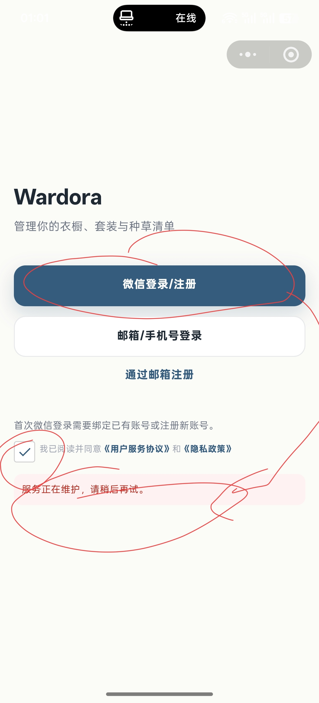

01：微信登录按钮可点击，但服务端失败被展示成维护提示；同时勾选框明显大于正文。

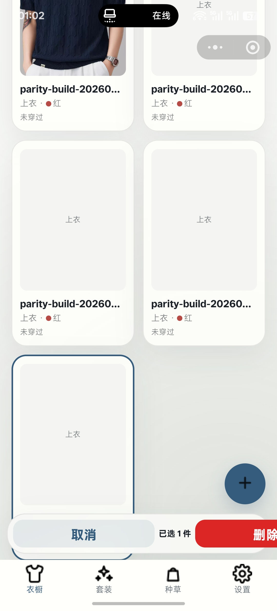

02：多选底部栏右侧删除按钮超出屏幕边界。

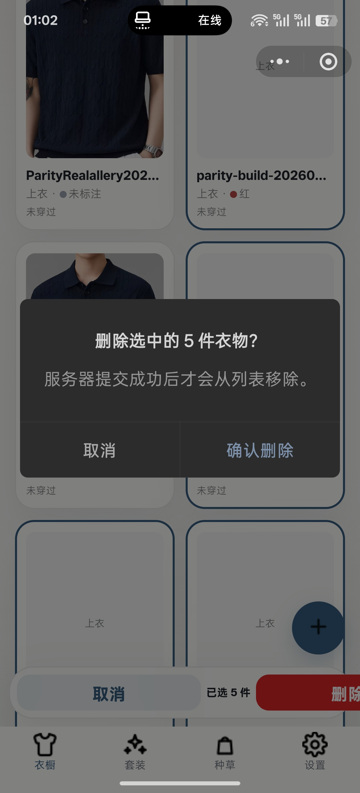

03：业务删除使用微信原生确认页，确认按钮不是规范危险色。

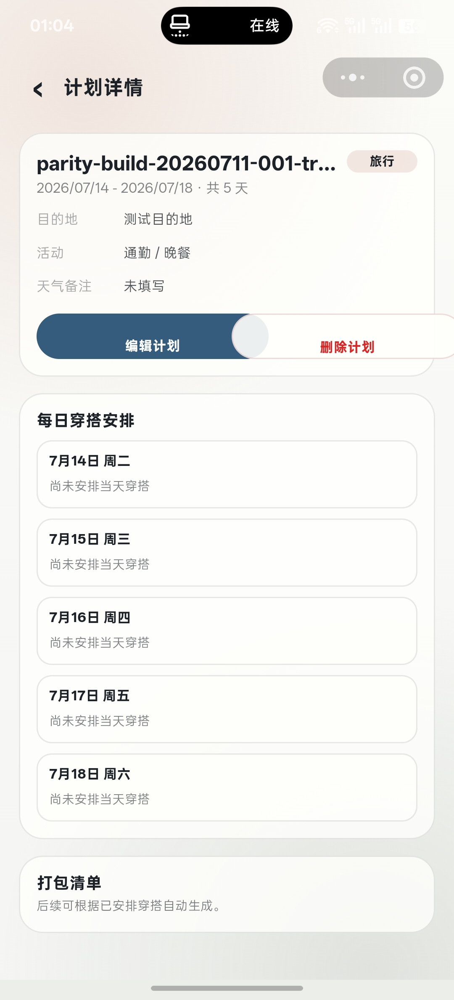

04：编辑和删除按钮的圆角双栏发生重叠。

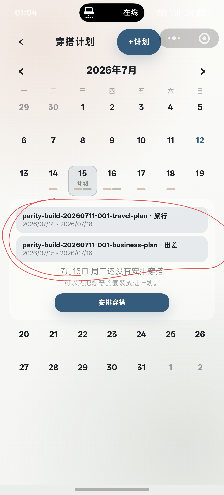

05：同日两个计划已经存在，但日期与下方列表的选择语义需要绑定具体计划。

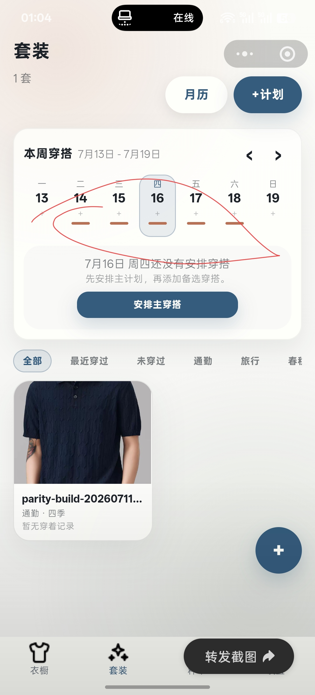

06：周历只显示一条粗横杠，与月历两条横杠不一致。

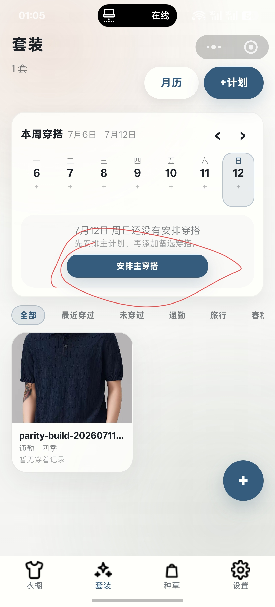

07：空状态仍叫“安排主穿搭”，应改为“+计划穿搭”。

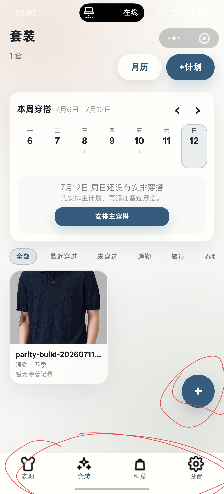

08：原生底栏没有毛玻璃浮层和选中色块。

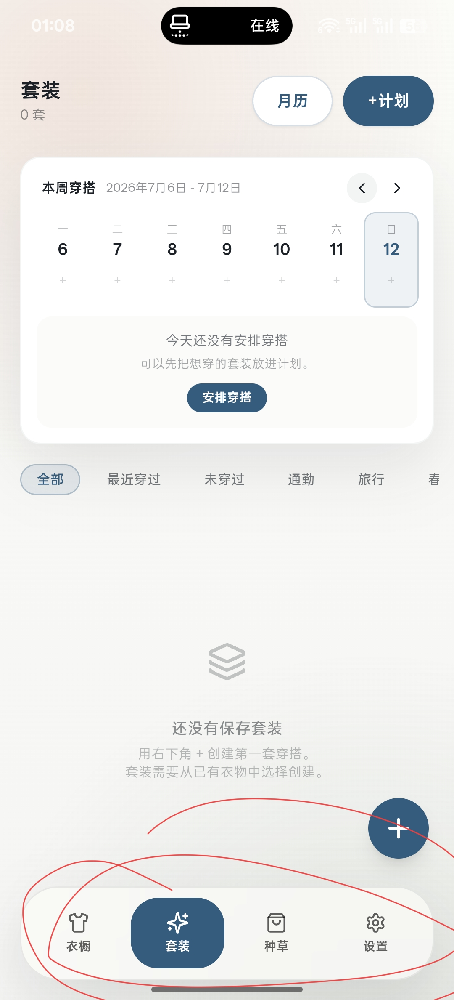

09：App 已有白色玻璃圆角导航和同心圆角选中项，应作为小程序参考。

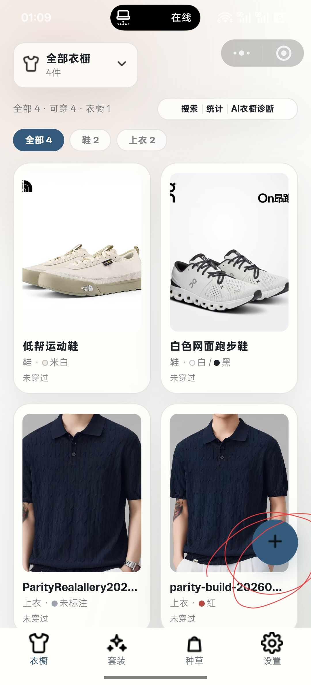

10：加号使用黑色文字且衣橱/种草入口样式不一致。

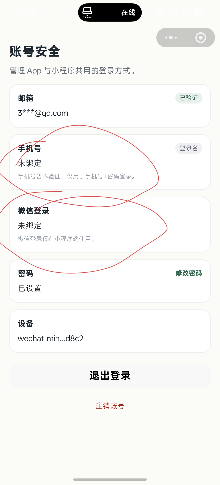

11：手机号和微信只有只读状态，邮箱、手机号和微信操作入口不完整。

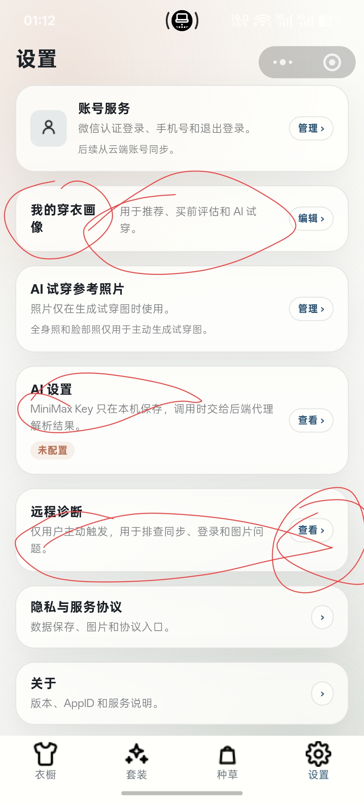

12：画像标题与正文横向排布，AI 设置和远程诊断使用开发化表述。

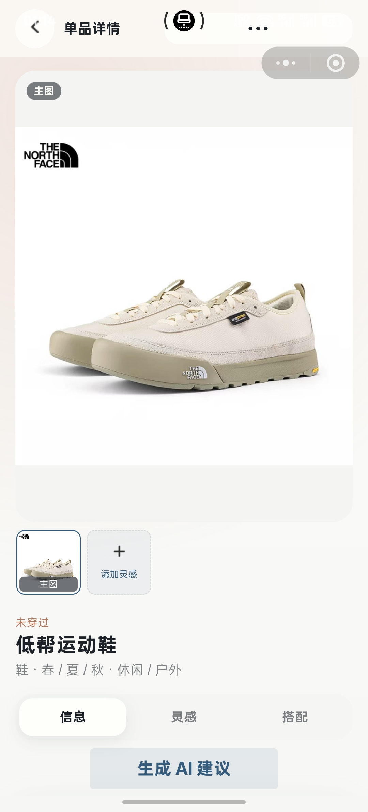

13：详情顶部与微信胶囊、三点菜单发生冲突，底部 AI 建议卡也没有对齐 App。

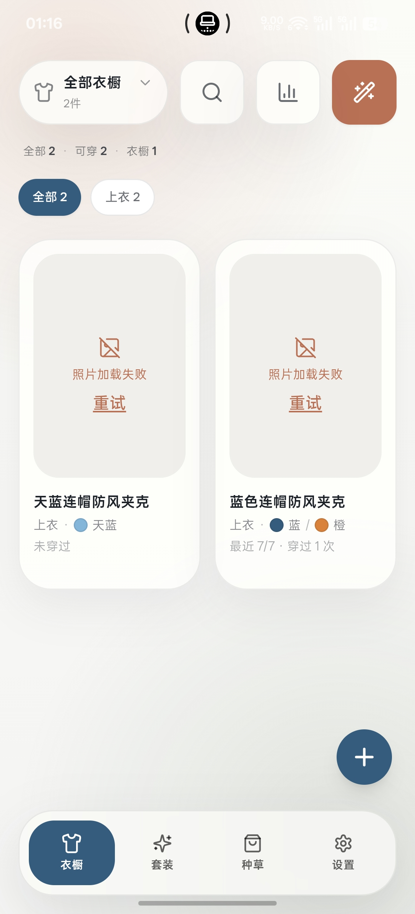

14：App 从后台恢复后图片全部进入失败态，重试没有恢复。

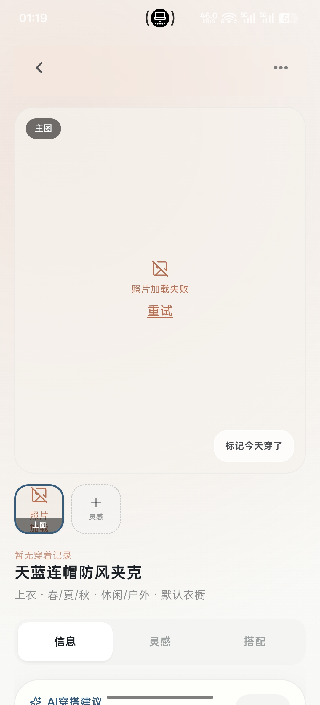

15：详情页内容被截在首屏，向下滑动无效。

### 第二轮新增截图

16：裁切/旋转和删除放在缩略图下方，缺少 App 参考中的浮动气泡和 SVG icon。

17：原生裁切页没有自由比例和 3:4 选择，也无法保持跨端一致的视觉。

18：拍照和图库按钮过大、间距不足，且没有图标。

19：App 入口具有图标槽和较紧凑的圆角卡片，是小程序应复用的交互参考。

20：添加种草页面顶部和底部都有非业务空白。

21：App 裁切器已经具备自由/3:4、旋转、重置和应用操作。

22：创建套装页面共享同样的顶部安全区和底部留白问题。

23：单品空状态同样未充分利用有效视口。

24：App 气泡位于缩略图上方，箭头指向缩略图顶部中点，文字单行且操作图标清晰。

## 7. 推荐执行批次

### 批次 0：P0 线上和 App 热修

1. 注入并验证微信 Secret，增加 ready 门禁。
2. 修复 Android inset 单位换算和重复安全区。
3. 修复 App 图片恢复 generation、取消请求和精确重试。
4. 修复 App 详情全屏滚动壳。

### 批次 1：小程序录入与共享 UI 基建

1. MiniIntakeSourceButton：单品/种草共用，补 SVG 图标。
2. MiniThumbnailActionPopover：气泡边界、箭头、单行文字、危险色。
3. MiniImageCropEditor：自由/3:4、旋转、重置、应用。
4. AuthConsent、业务确认 Sheet、窄屏多选栏。
5. SVG icon map、Custom TabBar、白色 Plus FAB、胶囊详情壳。

### 批次 2：计划和日历语义

1. date + calendarPlanId 作用域。
2. 同日多计划选择和详情入口。
3. 周历/月历两条 marker 统一。
4. 所有当日/未来空状态统一“+计划穿搭”。

### 批次 3：账号安全全栈

1. 新增认证挑战、邮箱、手机号、微信绑定契约。
2. 服务端事务、唯一性、会话撤销和安全审计。
3. App 绑定微信查看状态。
4. 小程序微信解绑/换绑。

### 批次 4：设置、诊断和 AI 建议

1. 恢复正式小程序诊断上传实现。
2. 直接上传并显示状态，不再提供“查看”。
3. 用户化 AI 设置和诊断文案。
4. 服务端 AI 建议读写与 App 卡片对齐。

## 8. 验收标准

### 小程序

- typecheck 通过。
- wechatide compile 通过，模拟器无重复原生/自定义底栏。
- 真机覆盖 360/390/430 宽度。
- 单品和种草空状态按钮都有 SVG 图标，按钮不重合。
- 选中第一/中间/最后一张缩略图，气泡始终在一级卡片内，箭头指向缩略图顶部中点，文字不换行。
- 自由比例和 3:4 裁切均能拖拽、旋转、重置、取消、应用。
- 多选栏不出框。
- 业务确认框 showModal 扫描为零；系统授权/权限弹窗作为平台边界单独记录。
- 计划同日 0/1/2/3 个、周历/月历 marker、空状态 CTA 全部一致。

### App

- 根 typecheck、逻辑测试、build 通过。
- Android 模拟器和真机安装固定签名 APK。
- 记录 MainActivity 注入的原生 inset、WebView 读取的 CSS inset 和 IntakeFlowShell 实际 header/footer 高度。
- 添加单品、种草、套装页面顶部和底部留白恢复到设计范围。
- 后台 30 秒、Token 过期、切网、force-stop/resume 后图片恢复；精确重试成功。
- 单品、种草、套装详情均可由主图和信息区向下滚动。
- 采集 logcat，筛查 FATAL、AndroidRuntime 和包名错误。

### 账号与服务端

- 真实 wx.login code 成功登录和绑定。
- 邮箱改绑、手机号绑定/换绑、密码修改/忘记密码、微信解绑/换绑均要求重新验证。
- 验证码过期、重复使用、目标账号冲突、最后登录方式保护、会话撤销均有测试。

## 9. 本轮交付边界

本次请求要求的是“探查问题并生成完整版解决方案 MD”，因此本轮没有修改业务代码、没有修改服务端配置、没有构建 APK，也没有把方案冒充成已修复结果。

本文件和截图资产位于：

docs/audits/2026-07-12-wardrobe-cross-platform-review/

截图资产位于：

docs/audits/2026-07-12-wardrobe-cross-platform-review/assets/

本文已按产品设计审计要求保留截图、编号步骤、健康度、问题证据、无障碍风险和截图无法证明的内容。
