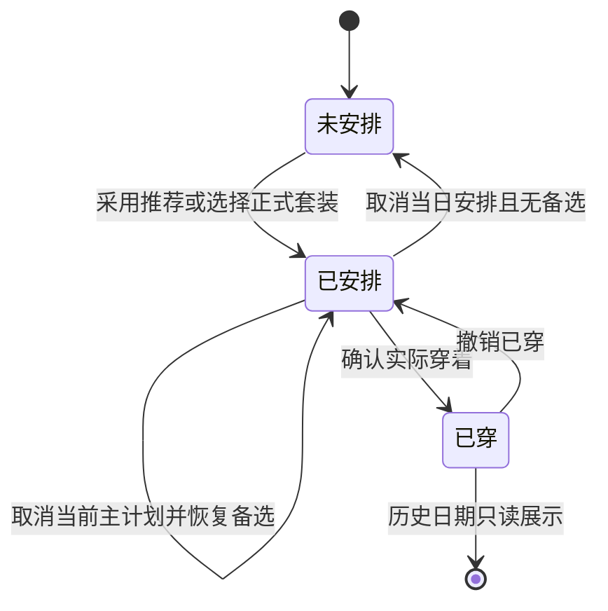
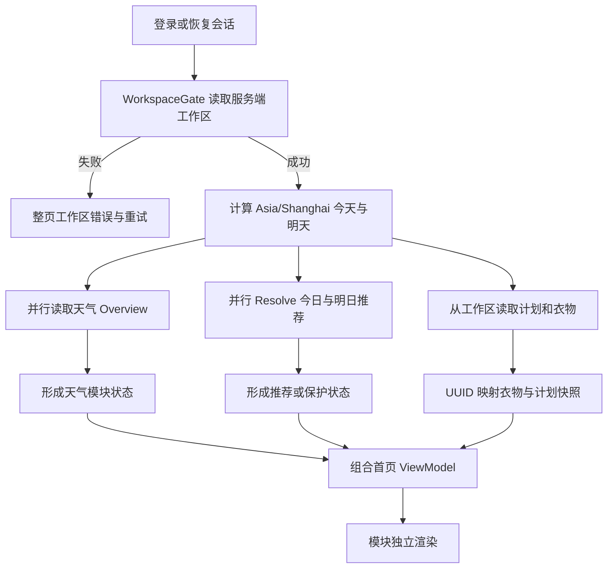
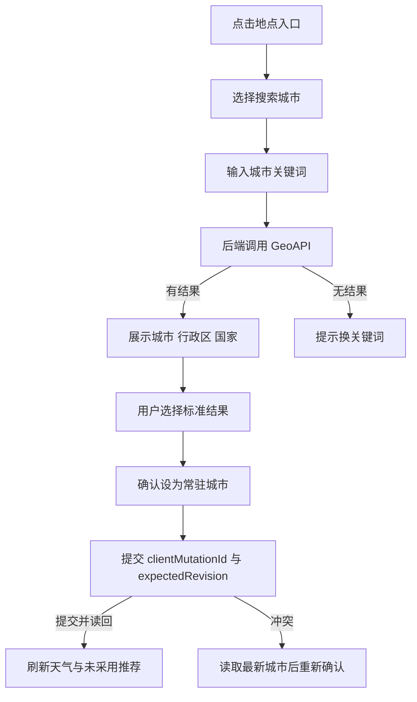
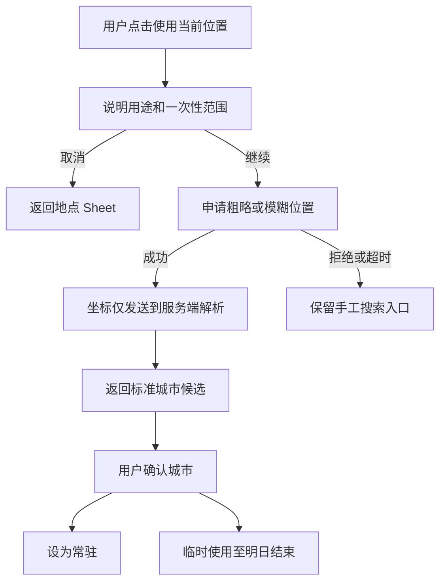
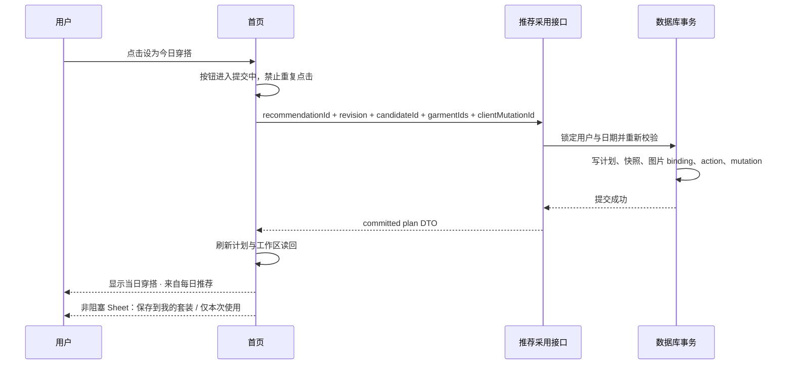
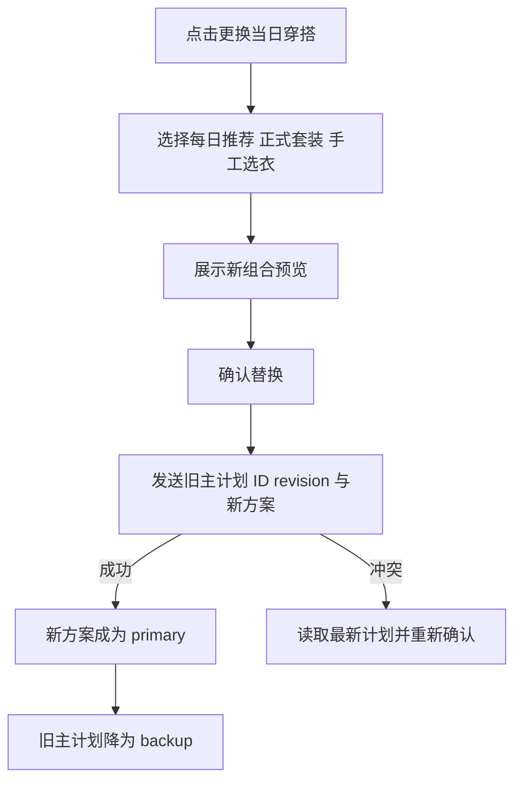
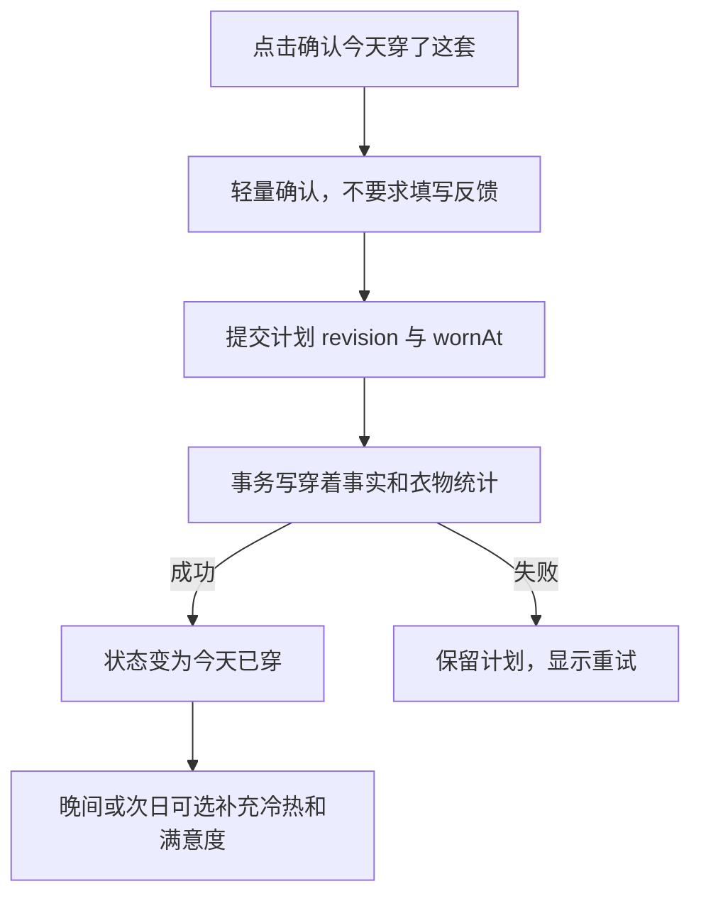
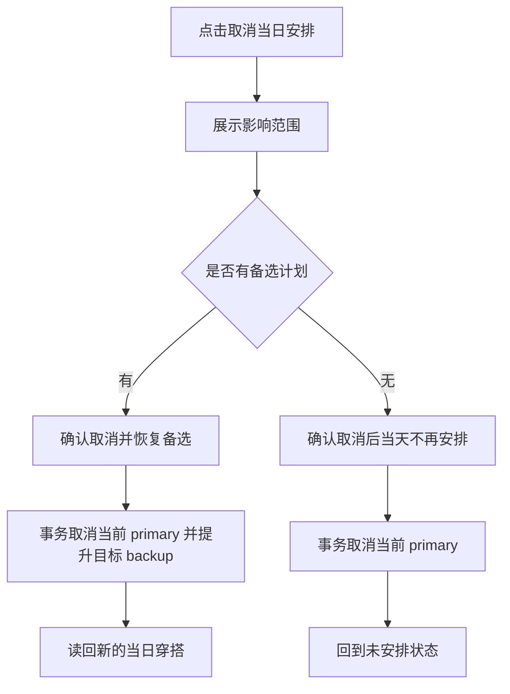

# Wardora v0.7.5-integrated：新首页生产构建与完整业务流程

| 版本 | 日期 | 修订人 | 说明 |
|---|---|---|---|
| v0.7.5-integrated | 2026-07-17 | Codex | 将新首页原型、实时推荐、天气、地点和计划采用收口为生产 PRD |

## 0. 文档定位与结论

### 0.1 文档用途

本文件把已经确认的新首页原型、城市与天气规则、实时推荐内核和计划采用能力，整理成一份可以直接用于产品评审、开发拆分和测试验收的生产实施文档。

它重点回答：

1. 新首页每个区域如何展示、点击和切换；
2. 首页进入后，衣橱、地点、天气、推荐和计划数据如何流动；
3. 网络、权限、天气、推荐和写入失败时如何处理；
4. 新注册用户、老用户换手机、重新安装、多设备并发等边界如何处理；
5. “设为当日穿搭”“更换当日穿搭”“取消当日安排”“确认已穿”“撤销已穿”“保存为我的套装”分别代表什么；
6. App 和微信小程序如何共用业务合同，又分别实现 Canvas 与定位；
7. 后续生产开发应按什么顺序推进。

### 0.2 当前事实

后端已经具备以下生产能力：

- 常驻城市、临时城市、旅行地点与无城市模式；
- QWeather 地点解析、天气缓存、天气降级和归属信息；
- 确定性规则实时推荐、输入指纹复用和今日/明日原子发布；
- `forecast / locationless / weather_fallback` 三种推荐模式；
- 推荐采用事务、计划快照、幂等、并发保护和已有主计划降为备选；
- 无 `outfitId` 的每日推荐计划读取；
- 确认已穿、撤销已穿和衣物穿着次数回滚。

当前主要缺口位于客户端生产层：

- App 与小程序尚未接入天气、地点、实时推荐和采用接口；
- 现有首页仍是衣橱目录，新首页路由和控制器尚不存在；
- 生产天气合同尚不足以直接驱动原型中的当前温度和明日日间天气动画；
- QWeather 62 个代码尚未沉淀为跨端共享的视觉字典；
- “取消当前主计划并原子恢复备选”尚缺少专用事务；
- App 与小程序尚未实现新首页的定位、Canvas 和完整状态机。

### 0.3 冻结决策

以下内容作为后续实施基线，不再由开发自行改写：

1. 新首页是登录后的默认主页面。
2. 底部保持四个功能 Tab，加一个居中创建按钮：`首页 / 穿搭 / 种草 / 设置`，中间为 `+`。
3. 原衣橱首页进入新首页内部的“衣橱”分栏；原套装与计划能力继续放在“穿搭”。
4. 首页内部默认选中“推荐”，可以切换到“衣橱”。
5. 打开首页不自动申请系统位置权限；定位只能由用户主动触发。
6. 无城市与衣橱为空是新用户的正常初始状态，不是错误或异常。
7. 推荐使用确定性规则，不使用 PAW，也不要求 MiniMax 才能运行。
8. 首页实时推荐通过稳定输入指纹复用；输入未变化时不重复计算。
9. 已确认当日穿搭不被天气刷新、城市变化、worker 或新推荐自动覆盖。
10. 未采用的推荐不能进入旅行打包或穿着统计。
11. “当日穿搭”“来自每日推荐”是用户界面用语；不展示“已选中每日推荐套装”等工程术语。
12. 天气 Canvas 只负责装饰，地点、温度、天气摘要、风险和操作必须由原生文字与控件承载。
13. 首页采用模块级加载和模块级错误；天气失败不能阻断衣橱，推荐失败不能阻断天气。
14. 所有正式业务写入必须等待服务器事务提交并读回后再显示成功，不做乐观更新。

## 一、产品概述

### 1.1 背景

Wardora 当前已经拥有衣橱管理、穿搭计划、正式套装、种草和设置等能力，但登录后的首屏仍以“管理衣橱”为中心。新首页要把产品重心调整为“今天穿什么”，让天气、衣橱和计划共同服务每日决策。

首页不是天气 App，也不是推荐算法的演示页。用户打开后应快速获得三个答案：

1. 今天和明天大致是什么天气；
2. 今天是否已经安排或确认了穿搭；
3. 如果还没有，当前衣橱中有哪些可直接采用的建议。

### 1.2 产品目标

#### 用户目标

| 目标用户 | 用户目标 | 可验证结果 |
|---|---|---|
| 新注册用户 | 看懂如何开始使用 | 无城市、空衣橱时有两条互不阻塞的下一步 |
| 已有衣橱用户 | 快速得到当天建议 | 首页进入后直接看到当日穿搭或 1—3 套建议 |
| 已安排用户 | 不被系统擅自改动 | 天气和推荐刷新只提示风险，不覆盖计划 |
| 经常出行用户 | 使用正确地点天气 | 行程地点自动高于临时和常驻城市 |
| 换手机用户 | 登录后恢复完整业务状态 | 衣橱、城市、计划、穿着与推荐均来自服务器 |

#### 工程目标

- App、服务端和小程序使用同一份地点、天气、推荐与计划语义；
- 首页加载可取消、可重试，快速切日期不会显示旧请求结果；
- QWeather 缓存由 API 与 worker 共享，不因首页并行请求重复计费；
- Canvas 异常、低端设备和 reduced-motion 均有静态降级；
- 推荐采用、替换、取消、确认已穿和撤销已穿均可审计、可幂等、无半状态。

### 1.3 非目标

首轮生产构建不做：

- PAW 或其他模型参与推荐排序；
- 打开首页自动索取定位；
- 后台持续定位或轨迹记录；
- 分钟级降水、台风、空气质量、辐照等天气 App 能力；
- 用户早晨必须填写冷热、满意度或不适原因；
- 未实现后端支持前就展示“假按钮”；
- 在客户端保存正式衣橱、计划、推荐或图片缓存；
- 将 HTML 原型脚本整体复制进生产组件；
- 为 App 和小程序各自维护一套天气代码口径。

### 1.4 名词说明

| 名词 | 产品含义 |
|---|---|
| 当日穿搭 | 某个日期当前主展示的计划，可以来自每日推荐、正式套装或手工选衣 |
| 每日推荐 | 尚未被用户采用的服务端推荐快照 |
| 正式套装 | 用户主动保存到“我的套装”的长期实体，可收藏和重复使用 |
| 主计划 | 某个日期首页和计划页优先展示的穿搭 |
| 备选计划 | 更换主计划后保留的旧安排，可再次恢复为主计划 |
| 已穿 | 用户确认实际穿着后形成的事实记录，会影响衣物穿着统计 |
| 取消当日安排 | 删除或撤销计划，不等于撤销穿着事实 |
| 撤销已穿 | 回滚穿着记录和穿着次数，但保留原计划 |
| 常驻城市 | 普通日期长期使用的天气地点 |
| 临时城市 | 用户主动确认、覆盖今天和明天的短期地点 |
| 行程地点 | 旅行计划命中日期时使用的地点，优先级最高 |

### 1.5 角色与权限

| 角色 | 权限 | 数据范围 |
|---|---|---|
| 未登录用户 | 注册、登录、找回账号 | 无权读取首页业务数据 |
| 已登录用户 | 查看和维护首页、城市、衣橱、推荐、计划与穿着 | 仅本人账号数据 |
| recommendation worker | 预热、重试和失效重算，不执行用户界面动作 | 按用户隔离的服务端任务 |

系统不设置能在首页查看其他用户衣橱的普通管理员角色。

### 1.6 文档阅读对象

| 对象 | 重点章节 |
|---|---|
| 产品与设计 | 第二、三、五、七、八章 |
| App 与小程序开发 | 第四、十、十一、十三章 |
| 服务端开发 | 第四、五、六、七、十章 |
| 测试与发布 | 第九、十二、十三、十四章 |

## 二、产品信息架构与首页布局

### 2.1 主导航

底部为四个功能 Tab，居中 `+` 不是第五个 Tab：

| 位置 | 显示名称 | 主要内容 |
|---|---|---|
| 左一 | 首页 | 天气、每日推荐、当日穿搭、首页内衣橱分栏 |
| 左二 | 穿搭 | 周计划、月历、正式套装、旅行计划与打包 |
| 中央 | `+` | 新增单品、套装或种草 |
| 右二 | 种草 | 买前评估、已买、不感兴趣、归档 |
| 右一 | 设置 | 账号、MiniMax、穿衣画像、城市、诊断等 |

规则：

- 登录成功后默认进入首页；
- 旧 `wardrobe_home` 的衣橱内容成为首页的“衣橱”分栏，不删除既有衣橱能力；
- `outfit_home` 继续承载穿搭计划与正式套装，底栏文案从“套装”收口为“穿搭”；
- 新首页必须有独立 route、控制器和组件目录，不能继续堆入主大组件；
- Android Back 在首页主层触发既有退出确认，不能误退到旧衣橱首页。

### 2.2 首页首屏结构

从上到下固定为：

1. 问候语和当前业务日期；
2. 地点入口；
3. 今天与明天天气卡；
4. “推荐 / 衣橱”分段控件；
5. 当前分栏内容；
6. 底部导航与中央创建按钮。

“推荐”分栏默认结构：

1. 当日已有穿搭时，先显示“当日穿搭”；
2. 没有当日穿搭时，显示日期条和每日推荐；
3. 有远期出行日期时，在普通七日推荐之后单列“出行推荐”；
4. 推荐卡片可横向浏览，但纵向滚动优先，不能抢占页面滚动；
5. 采用、替换和已穿操作固定在卡片或详情的明确位置，不藏在不可发现的手势里。

### 2.3 天气区域交互

#### 地点入口

地点模块左上角只显示一个当前权威地点入口：

```text
上海 · 常驻 ›
杭州 · 临时 ›
北京 · 行程 ›
未设置城市 ›
```

点击后打开地点 Sheet。不得在问候区、天气卡和推荐卡重复出现三个地点设置入口。

#### 今日与明日天气卡

- 今日卡展示当前温度、最高/最低温、天气摘要、体感或风等必要信息；
- 明日卡展示最高/最低温和日间天气摘要；
- 今日卡可以动态渲染 Canvas，明日卡默认静态；
- 点击今日或明日卡，将推荐日期切换到对应日期并滚动到推荐区；
- 天气卡无法提供合法天气时显示中性静态状态，不绘制伪天气；
- QWeather attribution 在使用供应商天气时按合同展示，不因卡片紧凑而删除。

### 2.4 推荐日期交互

- 默认选中今天；
- 日期条显示今天起七日；
- 今天和明天进入首页时一起预加载；
- 第 3—7 天只在用户点击时按需 resolve，不在每次首页打开时全部计算；
- 切换日期后保留首页滚动上下文，不重新播放整页入场动画；
- 快速连续切换日期时取消旧请求，只允许最后一次选择更新页面；
- 远期旅行日期不混入普通七日条，单列“出行推荐”，点击后按需加载；
- 未来日期按钮写“安排到 7 月 20 日”，今天写“设为今日穿搭”，明天写“设为明日穿搭”。

### 2.5 推荐卡与详情

推荐卡至少展示：

- 目标：稳妥、变化或舒适；
- 衣物图片和名称；
- 推荐标题与简短理由；
- 必要风险提示；
- 地点/场景来源摘要；
- 主操作按钮；
- 更多操作入口。

点击卡片进入临时推荐详情，不创建正式套装。详情操作按能力就绪后开放：

| 操作 | 产品行为 | 首轮要求 |
|---|---|---|
| 设为今日/明日穿搭 | 创建日期主计划 | P0 |
| 替换一件 | 同角色最多替换一件，再采用最终组合 | P0，但必须完成前端选择与服务端复验 |
| 穿上试试 | 进入既有 AI 试穿流程 | P1；没有 MiniMax Key 时引导设置，不阻断推荐 |
| 不喜欢 | 记录受控拒绝原因或轻量拒绝行为 | P1；后端 action 就绪前不展示死入口 |
| 保存为我的套装 | 创建正式套装，但不自动设为当日穿搭 | P0 |

### 2.6 动效原则

- 页面切换、Sheet 和分栏使用既有 Motion token；
- 普通状态切换 150—250ms，无弹跳；
- Sheet 可中断，进入和退出沿同一路径；
- 天气循环动画不承担状态反馈，不影响按钮点击；
- reduced-motion 下天气动画变为静态，页面切换只保留短交叉淡化；
- 页面内容默认可见，不能依赖动画结束才显示；
- 不编排整页逐项入场，不让用户等待“演出”。

## 三、首页状态模型

### 3.1 独立状态轴

首页不能用单一 `loading / success / error` 表达。至少有以下独立状态：

| 状态轴 | 状态 |
|---|---|
| 身份 | 初始化、未登录、已登录、会话过期 |
| 工作区 | 加载中、加载成功、加载失败 |
| 衣橱 | 空、资料不足、可推荐 |
| 地点 | 无城市、常驻、临时、行程 |
| 天气 | 加载中、fresh、合法 stale、fallback、不可用 |
| 推荐 | 加载中、复用、已生成、旧结果降级、未就绪、失败 |
| 计划 | 无计划、主计划、备选计划、已穿、风险阻塞 |
| 页面 | 推荐分栏、衣橱分栏、所选日期 |

### 3.2 四种正常首屏组合

| 衣橱 | 城市 | 天气区 | 推荐区 | 主要操作 |
|---|---|---|---|---|
| 空/未就绪 | 无城市 | 设置地点空状态 | 录入引导 | 录入第一件衣物 |
| 空/未就绪 | 有城市 | 正常天气 | 显示缺失角色 | 继续录入 |
| 已就绪 | 无城市 | 设置地点空状态 | 通用推荐 | 查看或采用 |
| 已就绪 | 有城市 | 正常天气 | 天气增强推荐 | 查看或采用 |

其中“衣橱为空 + 无城市”是新注册用户默认状态：

- 不使用警告色；
- 不显示“系统异常”或“重试”；
- 不自动弹定位权限；
- 设置城市与录入衣物互不阻塞；
- 只有服务器工作区读取失败时才显示真正的错误状态。

### 3.3 日期状态转换



### 3.4 用户可见状态文案

| 内部状态 | 用户界面 |
|---|---|
| `protected_plan` | 当日穿搭 |
| `actual_wear` | 今天已穿 |
| `locationless` | 未设置城市，当前使用通用推荐 |
| `weather_fallback` | 天气暂不可用，当前使用通用推荐 |
| `not_ready` | 按具体缺失角色提示，例如“还差一双鞋” |
| `served_stale` | 已显示上次可用建议，可稍后刷新 |
| `reused` | 正常展示，不额外暴露工程状态 |
| `generated` | 正常展示，不使用“算法刚生成”等技术文案 |

## 四、权威数据与首页数据流

### 4.1 数据权威

| 数据 | 权威来源 | 客户端允许保存 |
|---|---|---|
| 衣物、图片、正式套装 | Wardora 服务端 | 当前会话展示对象，不持久缓存 |
| 常驻/临时城市 | Wardora 服务端 | 当前会话状态 |
| 原始设备坐标 | 无持久权威，只用于一次解析 | 仅请求内存，解析后丢弃 |
| 天气证据 | 服务端 QWeather 共享缓存 | 当前会话展示对象 |
| 每日推荐 | 服务端版本化快照 | 当前会话展示对象 |
| 当日计划与已穿记录 | 服务端事务数据 | 当前会话展示对象 |
| MiniMax Key | 当前设备本地设置 | 可以；但不参与规则推荐 |

不得新增 IndexedDB、SQLite、Cache Storage、文件缓存、Outbox 或后台补写队列保存正式业务数据。

### 4.2 首页进入主流程



详细规则：

1. 工作区读取是前置条件。失败时不能把“未知”误画成空衣橱。
2. 工作区成功后，天气和推荐并行请求，互不等待。
3. 首页默认一次 resolve 今天和明天；服务端通过指纹决定复用还是计算。
4. 当前日期已存在主计划或已穿事实时，计划优先于推荐。
5. 推荐的 `garmentIds` 必须按服务端 UUID 匹配衣物，不能使用旧数字 ID。
6. 页面只在所有必需关系可解释时展示可采用卡片；缺失 UUID 时标记推荐失效并刷新。
7. 图片失败只影响对应缩略图，不能导致整套推荐消失；仍需保留名称和操作语义。

### 4.3 请求生命周期

- 首次进入首页：请求工作区、天气和今日/明日 resolve；
- 同一次页面会话内重复点首页 Tab：不重复 force，不清空已显示内容；
- App 从后台恢复：离开超过 5 分钟、发生跨日或工作区有新 revision 时重新请求普通 resolve；5 分钟内恢复沿用当前会话结果；
- 用户下拉刷新：使用 `force=true`，但结果仍是确定性重算，不代表随机“换一批”；
- 切换第 3—7 天：按日期请求一次，切走后可保留当前会话内结果；
- 快速切换：旧请求通过 AbortController 或平台等价机制取消，响应必须校验 request token；
- 离开首页：停止 Canvas、取消不再需要的读请求，但不得中断已经提交的写事务；
- 写请求超时：使用同一 `clientMutationId` 查询/重试，不能创建第二个动作。

### 4.4 首页组合 ViewModel

客户端控制器应把后端 DTO 转换成稳定的首页展示模型，页面组件不直接拼接接口字段。

```ts
interface HomeFeedViewModel {
  businessDate: string;
  selectedDate: string;
  location: HomeLocationViewModel;
  weather: HomeWeatherViewModel;
  wardrobeReadiness: HomeReadinessViewModel;
  recommendation: HomeRecommendationViewModel;
  primaryPlan?: HomePlanViewModel;
  backupPlans: HomePlanViewModel[];
}
```

转换层负责：

- 内部 code 到中文文案；
- QWeather code 到天气视觉场景；
- UUID 到衣物展示对象；
- 计划快照与当前衣物状态合并；
- 风险、缺失角色和可执行动作判定；
- 阻止 fallback 状态展示虚假温度、降雨和天气图形。

### 4.5 今日/明日一致性

- 两日均无保护计划时，应来自同一个 `generationBatchId`；
- `pairConsistent=false` 时不把两批不同上下文的推荐拼成一组；
- 有上一组合法一致结果时继续展示上一组并提示可重试；
- 没有上一组时，今天和明天分别显示明确状态，但不能把失败日期伪装成成功；
- 某一日已有计划或已穿时，该日可独立显示保护状态，另一日继续正常生成；
- 首页停留过程中后台生成新 revision，不突然替换用户正在查看的卡片，等下次进入、恢复或主动刷新再更新。

## 五、地点与天气业务流程

### 5.1 地点优先级

每个目标日期独立解析：

```text
已确认行程地点
> 覆盖该日期的临时城市
> 常驻城市
> 无城市模式
```

设备定位权限、上次定位城市和设备本地缓存不得参与后台地点选择。

### 5.2 手工设置常驻城市



规则：

- 只保存 QWeather 标准 `LocationID + displayName + timezone`；
- 自由输入文本不能直接保存；
- 城市保存成功后天气立即刷新；
- 已确认计划不被覆盖，只重新展示风险；
- 城市写入失败时保留搜索词和选中候选；
- 清除常驻城市只放在设置页，并进行明确二次确认。

### 5.3 使用当前位置



平台规则：

- Android App 只申请前台粗略位置；
- 微信小程序只申请模糊位置；
- 不申请后台位置，不持续 watch；
- 定位成功也必须由用户确认后才写入；
- 原始坐标不写数据库、普通日志或埋点；
- 永久拒绝后，仅在用户再次主动点击时提供“前往系统设置”。

### 5.4 临时城市

- 生效范围由服务端按 `Asia/Shanghai` 计算为今天至明日；
- 到期后自动恢复常驻城市，无常驻城市时恢复无城市模式；
- 用户可提前恢复常驻城市；
- 用户可将临时城市转为常驻城市；
- 行程日期仍使用行程地点；
- 临时城市保存在服务端，因此同一账号换手机登录后仍能看到有效覆盖。

### 5.5 天气展示与 Canvas

生产天气合同需要补齐：

| 字段 | 用途 | 兼容方式 |
|---|---|---|
| `currentTemperatureC` | 今日大号当前温度 | 可选新增字段 |
| `currentFeelsLikeC` | 今日体感 | 可选新增字段 |
| `dayWeatherCode` | 明日日间场景 | 可选新增字段 |
| `nightWeatherCode` | 昼夜差异或后续摘要 | 可选新增字段 |

现有 `weatherCode` 保留，旧客户端不受影响。今日视觉优先使用实时 `now.icon`，明日使用逐日 `iconDay`；未知或不支持的代码进入 `998` 静态降级。

Canvas 生产规则：

- QWeather 62 个 code 映射到共享的 `scene / palette / intensity / staticFallback`；
- App 使用 DOM Canvas，小程序使用微信 Canvas 2D；
- 两端共享纯数据视觉字典，不强行共享绘图运行时；
- 今日最多一个动态 Canvas，明日静态；
- 使用单一 `requestAnimationFrame` 调度，目标约 29 FPS；
- DPR 上限 2；
- 离屏、切后台、锁屏和页面卸载时暂停或销毁；
- reduced-motion、Canvas 不支持、初始化异常和低端设备进入静态模式；
- Canvas 位于天气文字下方或后方，不遮挡文字和点击区域；
- 文字、按钮和风险不通过 Canvas 绘制；
- 视觉基准以 v0.2.3 HTML 及其 SHA-256 为准，不复制原型中的假数据、localStorage 或调试控件。

### 5.6 天气故障

| 情况 | 展示 | 推荐行为 |
|---|---|---|
| fresh | 正常天气和 Canvas | forecast |
| 合法 stale | 显示上次天气并标注更新时间 | 先使用合法证据并后台刷新 |
| 超过 max stale | 不显示旧温度和降雨，静态中性卡 | weather_fallback |
| 无城市 | 设置地点空状态，不显示天气数字 | locationless |
| QWeather 429 | 遵守 Retry-After，不连续请求 | 合法 stale 或 fallback |
| 部分 endpoint 失败 | 仅使用仍合法的 endpoint 证据 | 按目标日期组合，不混用今日实时到明日 |

## 六、实时推荐业务逻辑

### 6.1 规则链

```text
日期、计划、地点、天气、衣橱和历史
→ DateContext
→ 硬过滤
→ 单品预评分和分类剪枝
→ 固定模板、已保存套装变体、锚点和 Beam Search
→ 规则初评
→ 12—18 套候选池
→ 确定性风险评价
→ 稳妥 / 变化 / 舒适排序
→ Jaccard 多样性
→ 返回 1—3 套
```

不使用 PAW，也不让客户端重新排序服务端结果。

### 6.2 三种上下文

| 模式 | 触发 | 可以使用 | 禁止使用 |
|---|---|---|---|
| forecast | 有已确认地点和合法天气 | 温度、体感、雨、风、分层 | 伪造数据 |
| locationless | 无任何已确认地点 | 衣橱适应性、场景、轮换、模板 | 精确温度、降雨、月份推断当地季节 |
| weather_fallback | 有地点但天气失效 | 与无城市相同的通用分层规则 | 过期温度、雨、风和伪天气文案 |

### 6.3 衣橱就绪

不按固定衣物总数判断，而按合法模板判断：

- 上装 + 下装 + 鞋；
- 上装 + 半身裙 + 鞋；
- 连衣裙/连体装 + 鞋；
- 按场景可增加外套、包或配饰。

未就绪时必须返回具体缺失角色或字段：

```text
衣橱还是空的
还差一双鞋，就可以开始生成每日推荐
有 2 件衣物缺少主图，补充后可参与推荐
```

不得为了凑满三套把清洗中、维修、归档、无图或硬过滤失败的衣物放回候选。

### 6.4 输入指纹与刷新

输入指纹包含：

- 算法和规则版本；
- 日期、地点来源、天气证据版本；
- 衣物状态、属性和主图可用性；
- 正式套装和历史成功摘要；
- 穿着记录与可选反馈；
- 旅行活动和计划保护状态。

输入指纹排除请求时间、生成时间和展示文案。

刷新规则：

- 指纹相同：复用 current，不重复运行规则、不重复请求 QWeather；
- 指纹变化：生成新 revision，成功后原子替换未采用推荐；
- 用户主动刷新：强制走协调器，但不随机换一批；
- 已确认计划：返回保护状态和风险，不替换计划；
- 页面停留：新结果不在用户阅读中途突然替换。

### 6.5 已有计划时的推荐

某日期已有主计划时：

1. 首页首先展示主计划；
2. resolve 返回 `protected_plan` 或 `actual_wear`；
3. 系统只做风险重评，不生成自动替换；
4. 用户点击“更换当日穿搭”后，才进入备选选择流程；
5. 若该日期仍有最近一次 current 推荐，可作为“备选建议”展示，但采用时仍由服务端重新校验；
6. 若没有可用 current，不暗中绕过保护生成，先提供正式套装和手工选择入口；
7. 后续若需要在保护状态下重新生成备选，应新增明确的“只生成备选、不发布为主计划”合同，不能复用普通 force 偷偷改变语义。

## 七、当日穿搭完整业务流程

### 7.1 业务对象边界

每日推荐通常由 2—9 件衣物构成，用户点击某张推荐卡的“设为今日穿搭”，实际确认的是整套组合，不是只确认其中一个单品。

三类实体必须分开：

| 对象 | 是否持久化 | 是否进入打包 | 是否进入穿着统计 |
|---|---:|---:|---:|
| 未采用每日推荐 | 是，作为短期推荐快照 | 否 | 否 |
| 当日穿搭计划 | 是 | 是，前提是日期和衣物仍有效 | 否 |
| 已穿事实 | 是 | 已是事实，不再作为未来待打包项 | 是 |
| 正式套装 | 是 | 只有被安排到日期后才进入 | 本身不增加统计 |

### 7.2 无已有计划：设为今日穿搭



交互规则：

- 点击后立即给按压和加载反馈，但不提前显示成功；
- 同一日期其他推荐卡的采用按钮暂时不可用；
- 保存成功后推荐区原位切换为“当日穿搭”；
- 采用成功后的 Sheet 不阻塞计划保存，关闭 Sheet 不会撤销计划；
- “仅本次使用”只关闭 Sheet；
- “保存到我的套装”另走正式套装创建事务；
- 采用失败时留在推荐卡，保留当前组合和滚动位置。

### 7.3 推荐已经变化或衣物失效

服务端采用时重新读取当前衣物和上下文：

| 失败原因 | 前端处理 |
|---|---|
| 推荐 revision 变化但旧候选仍合法 | 允许采用并记录来源 revision |
| 衣物删除、归档、清洗、维修或 blocked | 409，提示“这套建议中的衣物状态已变化” |
| 当前天气产生阻塞风险 | 409，提示查看更新后的建议 |
| 跨账号衣物或 candidate 不存在 | 不展示详细内部信息，刷新工作区 |
| 网络超时，提交结果未知 | 不生成新 mutationId；先读回计划或用原 mutationId 重试 |

任何失败都不得留下半条计划、孤立 action、孤立图片 binding 或两个主计划。

### 7.4 当天已有主计划：更换当日穿搭



规则：

- 必须显示当前主计划与将替换成的方案；
- 按钮写“更换当日穿搭”，不写模糊的“确定”；
- 旧计划降为备选，不直接删除；
- 新方案提交和旧方案降级在同一事务中完成；
- 已确认穿着的日期不能直接更换，必须先“撤销已穿”；
- 两台设备同时更换时，只有一个请求成功，另一台刷新到最新主计划；
- 推荐采用使用 `replaceExistingPrimary.planEntryId + expectedRevision`；
- 正式套装或手工选衣应复用同一日期锁与 primary 唯一约束。

### 7.5 替换推荐中的一件衣物

1. 用户从推荐详情点击“替换一件”；
2. 选择要替换的角色，例如鞋；
3. 仅展示当前可用且同角色的衣物；
4. 新组合实时预览，不创建临时正式套装；
5. 最多替换一个角色；
6. 服务端重新校验模板、天气、状态、用户归属和必要 slot；
7. 采用后计划记录 `sourceVariant=item_replaced`、原始衣物 IDs 和最终衣物 IDs；
8. 替换失败时保留原推荐，用户可以返回或重新选择。

### 7.6 确认今天已穿

当日主计划处于 `planned` 时显示“确认今天穿了这套”。



规则：

- 默认确认计划中的整套衣物；
- 不在早晨强迫填写冷热、满意度或不适原因；
- 写入成功后才更新衣物穿着次数；
- 同一计划重复确认必须幂等；
- 计划中已删除的衣物不能作为新的可穿实体，但历史快照仍可显示；
- 若计划存在阻塞风险，先提示用户调整，不允许无提示地确认。

### 7.7 撤销已穿

“撤销已穿”只回滚穿着事实，不删除当天计划：

1. 用户从“今天已穿”的更多菜单点击“撤销已穿”；
2. Sheet 明确说明：“将撤销这次穿着记录和衣物次数，保留当天安排”；
3. 提交原记录 revision 和稳定 `clientMutationId`；
4. 服务端删除对应 wear events，回滚衣物 wornDates/统计；
5. 计划从 `worn` 恢复为 `planned`；
6. 成功后重新显示“确认今天穿了这套”。

如果请求失败，保持“今天已穿”，不能先在界面回滚。

### 7.8 取消当日安排

“取消当日安排”只适用于尚未确认已穿的计划。



产品规则：

- 不使用“删除”描述可恢复的计划切换；
- 有备选时列出将恢复的备选，默认恢复最近一次主计划；
- 用户也可以在多个备选中选择一个恢复；
- 没有备选时明确提示“取消后今天将没有已安排穿搭”；
- 如果计划已是 `worn`，引导先“撤销已穿”；
- 正式套装实体不会随计划取消而删除；
- 推荐快照和 action 继续保留审计关系。

当前通用删除和设主计划接口无法保证“取消 primary + 恢复 backup”一次事务完成。生产接入前必须补一个原子取消/恢复合同，不能由客户端连续调用两个写接口拼接。

### 7.9 保存为我的套装

“保存为我的套装”与“设为当日穿搭”互不替代：

- 从推荐详情保存：创建正式套装，不安排日期；
- 采用成功后保存：计划已独立提交，随后创建正式套装；
- 正式套装使用最终衣物组合，包括用户替换的一件；
- 创建失败不回滚已成功的当日计划；
- 创建成功后计划来源仍显示“来自每日推荐”，不偷偷改写为 saved_outfit；
- 重复点击使用同一 mutationId；
- 正式套装需要名称时使用已有套装创建流程，不在非阻塞 Sheet 强塞完整表单。

### 7.10 实际穿着与原计划不同

如果用户最终穿了另一套正式套装或手工组合：

- 用户主动选择“记录实际穿着”；
- 实际穿着成为该日主要事实；
- 原计划保留为“原安排”，不静默删除；
- 穿着统计只计实际穿着的衣物；
- 撤销实际穿着后，原计划恢复为 `planned`；
- 系统不能根据用户浏览、试穿或保存套装推断实际穿着。

## 八、新用户、新设备与账号边界

### 8.1 新注册用户首次进入

顺序：

1. 注册成功并建立服务器工作区；
2. 首页显示模块骨架；
3. 工作区明确返回空后，展示“未设置城市 + 衣橱还是空的”；
4. 不弹定位权限；
5. 用户可先录衣物，也可先设置城市；
6. 设置城市后即使衣橱为空也能显示天气；
7. 录入达到合法模板后，无城市也能显示通用推荐。

必须区分：

- 服务器明确返回空：正常空状态；
- 工作区请求失败：错误状态与重试；
- 请求仍在进行：骨架屏。

### 8.2 老用户在新手机首次登录

服务器恢复：

- 衣物和图片；
- 正式套装；
- 常驻城市与有效临时城市；
- 旅行、计划、推荐和已穿记录；
- 穿着统计。

不会自动恢复：

- 旧手机中的 MiniMax Key；
- 旧手机系统定位授权；
- 尚未提交的录入、裁切或表单草稿；
- 页面滚动位置和当前临时 UI 状态。

规则：

- 首页推荐不依赖 MiniMax Key，因此新手机未配置 Key也能工作；
- 已保存城市可直接获取天气，不需要再次定位；
- 有效临时城市属于账号服务器数据，会随登录恢复；
- 定位权限由新设备单独决定，只有用户主动点击时才申请；
- 不从旧设备或本地缓存猜测城市。

### 8.3 卸载重装

- 重新登录后按新设备逻辑处理；
- 服务端业务数据恢复；
- MiniMax Key 需要重新配置；
- 不展示旧安装遗留的本地业务数据；
- 首次工作区读取失败时不能误认为账号为空。

### 8.4 多设备同时使用

| 场景 | 处理 |
|---|---|
| A 手机改常驻城市，B 手机仍开着首页 | B 下次恢复/刷新读取最新 revision，不静默覆盖 |
| 两台设备同时采用不同推荐 | 日期锁保证一个 primary；失败设备刷新最新计划 |
| 一台确认已穿，另一台更换计划 | 更换因 revision/状态冲突被拒绝，提示先刷新 |
| 一台取消已穿，另一台重复取消 | 幂等返回同一最终状态 |
| 同 mutationId 不同内容 | 409 冲突，不执行第二次写入 |

### 8.5 退出登录与账号切换

- 立即清空当前会话内首页 ViewModel、图片引用和请求；
- 不删除服务器业务数据；
- MiniMax Key按现有设备设置规则处理，不自动上传；
- 新账号登录后必须重新读取工作区，不能短暂显示上一个账号的首页；
- 进行中的写事务结果按原账号和 mutationId 落库，客户端切账号后不继续展示其结果。

### 8.6 会话过期

- 读请求 401 进入现有会话续期；
- 续期成功后重试一次读请求；
- 写请求不能在不确定是否提交时生成新 mutationId；
- 续期失败回登录页，并保留服务器上已提交的数据；
- 登录回来后从服务端重新读取，不能恢复旧页面的乐观状态。

## 九、差错处理与边界条件

### 9.1 全局处理原则

1. 空状态、加载状态和错误状态严格分开。
2. 读失败可以自动有限重试；写失败由用户明确重试。
3. 同一写草稿未变化时复用 `clientMutationId`。
4. 错误只影响相关模块，不无故盖住整页。
5. 已显示的合法数据优先保留，不先清空再请求。
6. 失败时说明数据是否保留、能否重试和下一步动作。
7. 不把服务端错误详情、SQL、供应商响应或内部 code 直接展示给用户。

### 9.2 异常矩阵

| 场景 | 页面行为 | 数据规则 | 恢复方式 |
|---|---|---|---|
| 工作区读取失败 | 整页错误，不展示假空衣橱 | 不写本地业务数据 | 重试或重新登录 |
| 天气读取失败 | 天气模块静态降级 | 不影响计划和衣橱 | 自动有限重试/手动刷新 |
| 推荐 resolve 失败 | 保留上次合法建议或模块错误 | 不撤销 current | 重试，不自动 force |
| 推荐 429 | 显示稍后重试 | 遵守 Retry-After | 到期后再请求 |
| 推荐衣物 UUID 缺失 | 卡片不可采用并刷新 | 不使用数字 ID 猜测 | 重新读取工作区/推荐 |
| 图片 404 | 单图占位 | 关系仍按 UUID | 可重试资源下载 |
| 采用 409 | 保留原卡片，提示条件变化 | 零半状态 | 刷新推荐或计划 |
| 采用超时 | 显示“正在确认结果” | 原 mutationId 不变 | 查询计划后再重试 |
| 城市 revision 冲突 | 显示最新城市 | 不覆盖其他设备写入 | 用户重新确认 |
| 定位拒绝 | 留在地点 Sheet | 不生成覆盖 | 手工搜索城市 |
| 定位超时 | 轻提示 | 不保存原坐标 | 重试或搜索 |
| Canvas 初始化失败 | 立即静态天气 | 不影响天气文字 | 本会话不重复崩溃初始化 |
| 日期跨午夜 | 切换业务日期 | 不把昨日计划当今日 | 重新读取今天/明天 |
| App 回后台 | 暂停 Canvas | 不取消已提交写事务 | 回前台普通刷新 |

### 9.3 衣物在计划后发生变化

| 变化 | 过去记录 | 今天/未来计划 | 打包 |
|---|---|---|---|
| 图片或名称更新 | 快照继续显示当时内容 | 可显示当前内容并保留来源快照 | 以当前可用实体为准 |
| 归档、清洗、维修 | 历史可显示 | 显示风险并要求替换 | 不作为可打包实体 |
| 删除 | 历史快照可显示 | 显示已删除，计划阻塞 | 不打包 |
| 缺主图 | 历史文字快照可显示 | 推荐不可继续采用 | 不自动删除计划 |

只有 ID 不能保证历史展示，因此计划继续保留 `garmentSnapshots`；ID 是关系权威，快照只用于历史展示和审计。

### 9.4 日期与时区边界

- 业务日期固定按 `Asia/Shanghai`；
- 设备处于其他时区时仍按上海日期判断“今天”；
- 不因为默认时区是东八区就默认用户在上海；
- 行程地点 timezone 只用于供应商天气切片；
- App 在上海午夜保持前台时，停止旧 Canvas，切换日期并重新读取今天/明天；
- 正在进行写事务时先等待结果，再切换展示日期；
- 未来日期到达当天后，原计划自动成为当日主展示，不需要复制一条新计划。

### 9.5 反馈边界

- 采用、替换、取消和拒绝由系统自动记录；
- 是否最终穿着由用户轻量确认；
- 满意度、冷热和不适原因在晚间或次日可选补充；
- 早晨采用推荐时不强制填反馈；
- 未填写反馈不影响继续使用推荐。

## 十、接口与合同需求

### 10.1 首页所需接口

| 能力 | 接口方向 | 说明 |
|---|---|---|
| 工作区 | App/小程序 → Wardora API | 衣物、图片、套装、计划和穿着 |
| 地点配置 | 双向 | 常驻城市和 revision |
| 临时覆盖 | 双向 | 今天/明天临时城市 |
| 城市搜索 | 客户端 → Wardora API → GeoAPI | 返回标准地点候选 |
| 设备坐标解析 | 客户端 → Wardora API | 原始坐标只用于单次解析 |
| 天气 Overview | 客户端 → Wardora API | 地点、来源、天气、freshness、attribution |
| 推荐 resolve | 客户端 → Wardora API | 今天/明天或选中日期的计算/复用 |
| 推荐读取 | 客户端 → Wardora API | 读取已有 current 与兼容版本 |
| 推荐采用 | 客户端 → Wardora API | 原子创建/替换计划 |
| 计划状态 | 双向 | 设主计划、确认已穿、撤销已穿 |
| 取消/恢复 | 客户端 → Wardora API | 原子取消 primary 并可提升 backup，需补齐 |

### 10.2 写入通用字段

所有地点、计划、已穿和正式套装写入至少需要：

| 字段 | 作用 |
|---|---|
| `clientMutationId` | 同一动作幂等 |
| `expectedRevision` | 防止覆盖其他设备的新数据 |
| 用户与设备身份 | 数据隔离和审计 |
| 服务端时间 | 生成 confirmedAt/updatedAt/selectedAt |

推荐采用额外需要：

- recommendationId；
- expectedRecommendationRevision；
- candidateId；
- selectedGarmentIds；
- 替换已有计划时的 planEntryId 与 expectedRevision。

### 10.3 错误信封

App 与小程序客户端必须保留：

- HTTP 状态；
- 稳定 error code；
- `retryable`；
- `retryAfterSeconds` 或 Retry-After；
- 可选受控 reasonCode；
- requestId。

不能在通用 HTTP 层丢弃限流和重试信息，也不能把自由服务端错误直接显示给用户。

## 十一、App 与小程序实现边界

### 11.1 可以共享

- cloud contracts 与严格 Schema；
- 首页状态机和纯选择器；
- QWeather 62 码视觉字典；
- 推荐原因、风险和目标中文映射；
- 上海业务日期工具；
- Fixture、验收矩阵和接口语义；
- 设计 token 的数值口径。

### 11.2 必须分开适配

| 能力 | App | 微信小程序 |
|---|---|---|
| HTTP | 既有 onlineRequest / CapacitorHttp | `wx.request` 服务层 |
| Canvas | React + DOM Canvas | WXML Canvas 2D |
| 定位 | Capacitor 粗略前台位置 | 微信模糊位置 |
| 生命周期 | visibility、route、Capacitor App | onShow/onHide/onUnload |
| 安全区 | CSS env + Android Insets | 胶囊与 safe area |
| reduced-motion | matchMedia / MotionConfig | 平台能力与应用内静态降级 |

小程序不直接引入依赖 Zod 的 workspace 包；继续使用生成的纯 TS 合同/字典和一致性测试，禁止手抄长期维护。

### 11.3 建议 App 文件边界

```text
src/components/home/wardora-home-view.tsx
src/components/home/use-home-feed-controller.ts
src/components/home/home-weather-card.tsx
src/components/home/home-recommendation-card.tsx
src/components/home/home-current-plan-card.tsx
src/components/home/home-feed-state.tsx
src/components/home/weather-canvas/
src/lib/home/home-presentation.ts
src/lib/home/shanghai-business-date.ts
src/lib/online/online-weather-client.ts
src/lib/online/online-recommendation-client.ts
```

新页面只组合组件和 ViewModel，不在组件里裸 `fetch`，也不继续扩大主 App 大组件。

## 十二、非功能需求

### 12.1 性能

| 指标 | 目标 |
|---|---:|
| 相同指纹复用 current | P95 ≤ 300ms |
| 缓存天气 + 规则推荐 | P95 ≤ 800ms |
| 首次天气请求或降级 | P95 ≤ 2s |
| 500 件衣橱规则内核 | P95 ≤ 300ms |
| 今日 Canvas | 目标约 29 FPS，不能阻塞滚动和按钮 |

页面先显示模块骨架，不等待所有模块完成后一次性出现。Canvas 不能成为首屏可用的阻塞条件。

### 12.2 安全与隐私

- 全部网络请求使用 HTTPS；
- QWeather 私钥和 JWT 私钥只存在服务端 Secret；
- 原始设备坐标不持久化；
- 推荐默认只使用结构化衣物属性，不把用户图片发送给第三方模型；
- 埋点不记录图片、原始坐标、自由地址、MiniMax Key 和完整衣橱内容；
- 不在日志打印 Token、Credential ID、私钥或用户数据。

### 12.3 无障碍

- 所有点击目标不小于 44px；
- 选中态不只靠颜色；
- Canvas 有 `aria-hidden` 或平台等价处理；
- 天气和推荐语义由真实文字提供；
- loading 使用可读状态，不持续播报百分比；
- 风险和错误有文字说明；
- 字体放大后不遮挡主操作；
- 360/375/390/412/430px 均无横向溢出。

### 12.4 观测指标

| 事件 | 关键属性 |
|---|---|
| `home_view` | wardrobeState、locationState、weatherState、planState |
| `home_location_open` | 当前地点来源 |
| `home_location_confirmed` | home/temporary，不记录坐标 |
| `home_recommendation_resolved` | reused/generated/fallback/not_ready、耗时 |
| `home_recommendation_accept` | success/conflict/error、sourceVariant |
| `home_plan_replace` | success/conflict |
| `home_plan_cancel` | restoredBackup/empty/error |
| `home_wear_confirm` | success/error |
| `home_wear_cancel` | success/error |
| `home_weather_canvas_fallback` | reducedMotion/unsupported/error/lowEnd |

## 十三、生产实施批次

### 13.1 批次 P0：生产前置合同收口——下一步执行

本批不切换可见首页，目标是消除前端必须猜测的合同缺口。

必须完成：

1. 天气 Overview 增加当前温度、当前体感、日间和夜间天气代码；
2. 保留旧 `weatherCode`，完成新旧客户端兼容测试；
3. QWeather 62 码视觉字典进入共享事实源，并为小程序生成纯 TS 输出；
4. 增加 `998` 未知代码和静态降级测试；
5. App/小程序错误层保留 Retry-After、retryable 和受控 details；
6. 增加 `Asia/Shanghai` 业务日期纯函数和跨午夜测试；
7. 冻结“取消主计划 + 恢复备选”的原子合同和 Fixture；
8. 更新 UI 规范的导航、首页状态矩阵、Canvas 与交互契约；
9. 运行 cloud contracts、API、App、小程序、视觉字典和 UI spec 门禁；
10. 共享/服务端变更进入 main 后，按项目规则部署生产 API 并同步小程序基线。

本批明确不做：

- 切换默认首页；
- 申请定位权限；
- 生产 Canvas 运行时；
- APK 或小程序体验版；
- 用户可见的推荐采用按钮。

### 13.2 批次 P1：App 新首页只读骨架与手工城市

- 新增首页 route 和默认导航；
- 底栏切换为首页/穿搭/种草/设置；
- 首页内部接入现有衣橱分栏；
- 建立 HomeFeed controller 与 ViewModel；
- 接入工作区、天气 Overview、推荐 resolve/read；
- 完成四种正常状态、loading、error、fallback；
- 接入城市搜索、确认、修改和清除；
- 先使用静态天气视觉，保留旧首页短期回退入口；
- 不申请系统定位。

### 13.3 批次 P2：App 计划与穿着闭环

- 设为今日/明日穿搭；
- 更换当日穿搭和旧计划降备选；
- 替换一件；
- 取消当日安排并原子恢复备选；
- 确认已穿和撤销已穿；
- 保存为我的套装；
- 409、超时、幂等重放和多设备并发；
- 已有计划、已穿和阻塞风险状态。

### 13.4 批次 P3：App 天气 Canvas 与一次性定位

- 将 v0.2.3 视觉系统拆成生产 Canvas 模块；
- 完成 today-only 动态、tomorrow 静态、29 FPS、DPR2；
- 完成后台/离屏暂停、异常恢复和 reduced-motion；
- 加入 Capacitor 粗略位置权限；
- 完成定位用途说明、候选确认、临时/常驻选择；
- 必须构建签名 APK做 Android 真机验证。

### 13.5 批次 P4：微信小程序完整对齐

- 最新 main 共享合同进入 `wechat/miniprogram`；
- 新首页替换休眠 home 跳转页；
- 接入天气、地点、推荐、计划和图片 join；
- 实现微信 Canvas 2D 适配，不逐帧 `setData`；
- 接入模糊位置和隐私声明；
- 覆盖 onShow/onHide/onUnload；
- 微信开发者工具和真机验证；
- 上传体验版仍需用户明确授权。

### 13.6 批次 P5：切换与发布

```text
共享合同与生产 API就绪
→ App 隐藏入口验证
→ App 真机完整业务 E2E
→ App 默认首页切换
→ 签名 APK 候选版
→ 小程序体验版
→ 双端回归与生产观测
→ 正式发布
```

发布时保留：

- 旧 API兼容读取；
- 已提交计划和推荐快照；
- 生产当前镜像和一个已验证回滚镜像；
- 旧衣橱内容作为首页内部衣橱分栏，不保留两套长期首页。

## 十四、验收标准

### 14.1 首页与空状态

- 新注册用户无城市、空衣橱时看到正常双空状态；
- 工作区失败不会误显示为空衣橱；
- 设置城市不要求先有衣物；
- 衣橱就绪但无城市可以生成 locationless 推荐；
- 位置权限不会在首页自动弹出；
- 首页、穿搭、种草、设置和 `+` 的选中/返回行为正确。

### 14.2 天气

- 今天使用实时 code 和当前温度，明天使用日间 code；
- 62 个 QWeather code 都能解析，未知 code 静态降级；
- 无城市、天气失效和 Canvas 失败时不显示伪天气；
- 今日动态、明日静态；
- reduced-motion 下没有循环动画；
- 低端 Android WebView 不因 Canvas 阻塞滚动或按钮；
- QWeather attribution 和更新时间口径正确。

### 14.3 推荐

- 相同输入重复进入首页复用相同 revision；
- 输入变化后只有未采用推荐更新；
- 今日/明日同批一致；
- 无城市不调用 QWeather；
- 不足三套时不放回不合格候选；
- 未来七日按需加载，远期旅行单列；
- 已有计划时计划优先，不被自动替换。

### 14.4 当日穿搭

- 采用成功后生成无隐藏正式套装的主计划；
- 成功前不提前显示“已安排”；
- 采用超时复用同一 mutationId；
- 更换主计划后旧主计划成为备选；
- 取消主计划与恢复备选原子完成；
- 已穿状态不能直接被替换或取消计划；
- 撤销已穿只回滚穿着事实，计划仍保留；
- 保存为我的套装失败不回滚已成功计划；
- 删除、清洗、维修和归档衣物在未来计划中显示风险且不能打包。

### 14.5 新设备与并发

- 换手机登录后恢复服务端衣橱、城市、计划和穿着；
- MiniMax Key 缺失不影响天气和规则推荐；
- 新手机不沿用旧手机定位权限；
- 两台设备并发采用只产生一个 primary；
- revision 冲突不会覆盖最新数据；
- 账号切换不短暂显示上一个账号的数据。

### 14.6 最低工程门禁

```text
cloud contracts typecheck
API typecheck + full tests
天气 Overview 与视觉字典 Fixture
推荐 resolve / accept / cancel / wear PostgreSQL 并发与幂等测试
App typecheck + logic + production build
小程序 typecheck + 生成合同一致性测试
UI spec build/check
360/375/390/412/430px overflow 与字体放大
Android 真机 Canvas、权限、Back、前后台和断网恢复
微信开发者工具与真机定位/Canvas 生命周期
git diff --check
```

## 十五、当前实施结论

### 15.1 下一步

下一步只执行“批次 P0：生产前置合同收口”。原因是当前后端已经能生成推荐和计划，但天气展示合同、共享视觉字典、错误重试信息和取消/恢复语义尚未完全闭合。直接开发首页会迫使 App 和小程序分别猜字段、补规则，后续一定返工。

P0 完成后，按 `P1 → P2 → P3 → P4 → P5` 串行推进。

### 15.2 无阻塞产品问题

本文件已经明确：

- 新首页导航；
- 新用户空状态；
- 城市与定位时机；
- 首页今日/明日和七日按需加载；
- 推荐采用、替换、取消和已穿语义；
- 已有计划保护；
- 新设备与多设备规则；
- App 与小程序实施边界。

后续开发不得把这些已冻结问题重新交给实现人员自由选择。若真实代码合同与本文冲突，应先记录差异并回到评审，不得静默改变产品语义。
