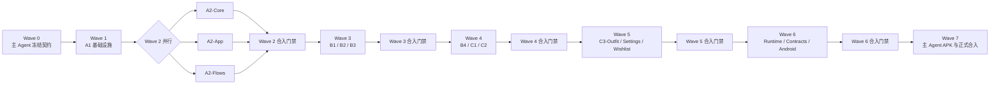

# 衣橱 App 动效修复 Subagent 并行执行方案

制定日期：2026-07-13
当前参考基线：`main` / `24ac3b22` / `2.1.18-test`
上位方案：[衣橱 App 动效全面审查与改良方案](./wardrobe-motion-improvement-plan.md)
适用范围：App 主端动效、手势、浮层、导航、无障碍和 Android 验证；不包含微信小程序、服务端、数据库和业务契约改造

> 本文是执行编排方案，不代表已经启动 subagent。真正开工时必须重新读取 `main` 最新 HEAD，不得机械使用本文记录的旧 SHA。

## 1. 执行结论

本任务改为**依赖分层并行**：有前后依赖的共享基础设施按 Wave 串联，同一 Wave 内文件所有权互斥的任务并行。当前团队最多 4 个活跃 Agent，因此主 Agent 常驻时，每个 Wave 最多同时启动 3 个实施 subagent。

采用以下模式：

- **1 个主 Agent 负责集成与验收。** 主 Agent 不把正式 `main` 当开发目录，只负责冻结每波契约、创建批次分支、审查提交、按既定顺序合入、集成验证、最终 APK 和清理。
- **16 个实施 subagent，分 6 个实施 Wave 执行。** Wave 1 仅建立基础；Wave 2～6 每波最多并行 3 个 subagent；本 Wave 全部通过并合入后，下一 Wave 才能启动。
- **运行时代码同波零重叠。** 同一 Wave 内禁止两个 subagent 修改同一运行时文件或同一大型文件区域；确需共享的 UI 规范、HTML 预览和 `VERSION_HISTORY.md` 作为受控文本冲突，由主 Agent 统一保全和重生成。
- **不额外启动独立审核 subagent。** 并行槽位优先用于实施；每波代码审查由主 Agent 完成，最终验证拆成运行时、契约和 Android 三条并行收口线。
- **禁止共享工作区。** 每个 subagent 使用独立分支、独立 worktree、独立目录并提交自己的修改。
- **不允许复制未提交成果。** 所有依赖通过已提交、已合入的批次分支传递。



## 2. 角色与责任边界

### 主 Agent / Integration Owner

负责：

1. 开工前确认 `main`、正式目录、tracked/staged 状态、worktree 占用和最新版本。
2. 创建唯一批次集成分支与集成 worktree。
3. 为每个 subagent 生成具体任务说明、分支和 worktree。
4. subagent 返回后检查 diff、测试、提交、越界修改和未验证风险。
5. 等待同一 Wave 全部返回，只在批次集成 worktree 按预定顺序逐个合并，解决受控文档冲突并重新运行 Wave 门禁。
6. 控制 `VERSION_HISTORY.md` 顺序、最终版本递增、APK、Android 验证、GitHub 推送和安全清理。

禁止：

- 在正式 `main` 目录直接开发。
- 在同一 Wave 尚未全部返回前提前启动下一 Wave，或并发执行两个 merge。
- 用 `git reset --hard`、强制 checkout、强推或永久删除解决冲突。
- 在某个 subagent 未提交时读取并复制它的工作区文件作为下一批基础。

### 实施 Subagent

每个 subagent 只负责任务卡内的文件和目标，并必须：

1. 完整阅读 `AGENTS.md`、用户体验档案、`README.md`、`package.json`、`VERSION_HISTORY.md` 最新接力记录、UI 规范、上位动效方案和本执行方案。
2. 报告 `base SHA / branch / worktree / 当前状态` 后再编辑。
3. 按任务卡更新 `docs/designs/wardrobe-ui-spec.md` 中自己拥有的小节，再生成/校验 HTML 预览，再改运行时代码；不得改动同 Wave 其他任务的小节。
4. 不改变信息架构、业务字段、线上数据源、API 契约、存储策略或 MiniMax 隐私边界。
5. 运行任务卡规定的测试，更新 `VERSION_HISTORY.md`，提交全部任务修改。
6. 返回 commit SHA、修改文件、验证命令与结果、未验证风险；不得自行合入批次分支、`main` 或推送 GitHub。

## 3. Git 与 Worktree 编排

### 3.1 批次集成分支

开工时由主 Agent 从**当时最新本地 `main`**创建：

```text
分支：codex/motion-repair-integration-20260713
目录：/Users/fangzheng/Documents/wardrobe-motion-repair-integration-20260713
```

示意命令：

```bash
git worktree add \
  '/Users/fangzheng/Documents/wardrobe-motion-repair-integration-20260713' \
  -b 'codex/motion-repair-integration-20260713' \
  main
```

批次分支仅由主 Agent 操作。每个 subagent 都从最新批次 HEAD 创建，而不是固定从本文的 `24ac3b22` 创建。

### 3.2 Subagent 分支与目录

| Wave | 任务 | 分支 | Worktree 目录 |
|---:|---|---|---|
| 1 | A1 Overlay / Back 基线 | `codex/motion-a1-overlay-back-20260713` | `/Users/fangzheng/Documents/wardrobe-motion-a1-overlay-back-20260713` |
| 2 | A2-Core 浮层组件 | `codex/motion-a2-core-20260713` | `/Users/fangzheng/Documents/wardrobe-motion-a2-core-20260713` |
| 2 | A2-App App 壳浮层 | `codex/motion-a2-app-20260713` | `/Users/fangzheng/Documents/wardrobe-motion-a2-app-20260713` |
| 2 | A2-Flows 业务流浮层 | `codex/motion-a2-flows-20260713` | `/Users/fangzheng/Documents/wardrobe-motion-a2-flows-20260713` |
| 3 | B1 按压与反馈 | `codex/motion-b1-feedback-20260713` | `/Users/fangzheng/Documents/wardrobe-motion-b1-feedback-20260713` |
| 3 | B2 图片手势 | `codex/motion-b2-image-gestures-20260713` | `/Users/fangzheng/Documents/wardrobe-motion-b2-image-gestures-20260713` |
| 3 | B3 周历/月历手势 | `codex/motion-b3-calendar-gestures-20260713` | `/Users/fangzheng/Documents/wardrobe-motion-b3-calendar-gestures-20260713` |
| 4 | B4 录入手势 | `codex/motion-b4-intake-gestures-20260713` | `/Users/fangzheng/Documents/wardrobe-motion-b4-intake-gestures-20260713` |
| 4 | C1 路由运动 | `codex/motion-c1-navigation-20260713` | `/Users/fangzheng/Documents/wardrobe-motion-c1-navigation-20260713` |
| 4 | C2 详情连续性 | `codex/motion-c2-detail-continuity-20260713` | `/Users/fangzheng/Documents/wardrobe-motion-c2-detail-continuity-20260713` |
| 5 | C3-Outfit 穿搭深层流 | `codex/motion-c3-outfit-20260713` | `/Users/fangzheng/Documents/wardrobe-motion-c3-outfit-20260713` |
| 5 | C3-Settings 设置与登录 | `codex/motion-c3-settings-20260713` | `/Users/fangzheng/Documents/wardrobe-motion-c3-settings-20260713` |
| 5 | C3-Wishlist 种草深层流 | `codex/motion-c3-wishlist-20260713` | `/Users/fangzheng/Documents/wardrobe-motion-c3-wishlist-20260713` |
| 6 | D1-Runtime 无障碍与性能 | `codex/motion-d1-runtime-20260713` | `/Users/fangzheng/Documents/wardrobe-motion-d1-runtime-20260713` |
| 6 | D1-Contracts 契约回归 | `codex/motion-d1-contracts-20260713` | `/Users/fangzheng/Documents/wardrobe-motion-d1-contracts-20260713` |
| 6 | D1-Android 真机验收 | `codex/motion-d1-android-20260713` | `/Users/fangzheng/Documents/wardrobe-motion-d1-android-20260713` |

日期后缀在真正执行时可按开工日期更新，但所有路径必须逐项展开确认，不能用通配符。

### 3.3 每个 Session 的固定生命周期

```text
本 Wave 冻结 HEAD 与接口契约
  → 从同一 HEAD 创建最多 3 个独立 branch/worktree
  → subagent 并行编辑、测试、更新 history、commit
  → 主 Agent 等待本 Wave 全部返回并横向审查
  → 批次集成 worktree 按既定顺序逐个执行 --no-ff merge
  → 主 Agent 保全共享文档并重生成 UI 规范 HTML
  → 主 Agent 运行 Wave 门禁并记录新批次 HEAD
  → 下一 Wave 全部从该新 HEAD 创建
```

任务失败或越界时不合并。其余同 Wave 合格任务可先进入待合入队列，但不得据此启动下一 Wave；主 Agent 缩小任务说明后让原 subagent 修复并补充提交。

## 4. Wave 0：主 Agent 开工准备

主 Agent 在启动第一个 subagent 前完成：

1. 确认正式目录是 `main`，无 tracked/staged 修改或未完成 Git 操作；明确现有未跟踪文件清单并加入“禁止触碰”列表。
2. 记录 `main HEAD`、`package.json` 版本、`origin/main...main` ahead/behind 和全部 worktree。
3. 创建批次集成 worktree。
4. 将批准后的两份方案复制为仓库内持久文档：
   - `docs/superpowers/plans/2026-07-13-wardrobe-motion-improvement-plan.md`
   - `docs/superpowers/plans/2026-07-13-wardrobe-motion-subagent-execution-plan.md`
5. 更新 `VERSION_HISTORY.md`，提交一笔纯文档基线提交。
6. 在 UI 规范中预先建立 Wave 级独立小节和公共组件接口，冻结 Overlay、MotionSheet、路由容器、详情连续性与 reduced-motion 的公开契约，避免并行 Agent 自行发明接口。
7. 明确共享文件策略：运行时代码同 Wave 禁止重叠；`wardrobe-ui-spec.md` 仅改自己的命名小节；生成 HTML 与 `VERSION_HISTORY.md` 允许主 Agent 在合入时人工保全并统一重生成。
8. 在批次 worktree 执行初始门禁，记录已有失败，避免把基线问题误算成 subagent 回归：

```bash
npm run docs:ui-spec:check
npm run test:logic:ui-spec-preview
npm run test:logic:ui-token-contract
npm run test:logic:ui-overlay-contract
npm run typecheck
npm run build
```

## 5. Subagent 任务卡

### Subagent A1 — OverlayRoot、OverlayStack 与 BackCoordinator

前置：Wave 0 已合入。
目标：建立唯一浮层栈和唯一 Back/Escape 消费入口，但暂不大规模迁移页面。

允许重点修改：

- `src/components/motion-common.tsx`
- `src/components/motion-provider.tsx`
- `src/lib/use-stable-back-handler.ts`
- `src/components/wardrobe-app.tsx` 中顶层 Back/Escape 与 provider 挂载部分
- 新增 `src/lib/overlay-*` 或 `src/components/overlay-*` 小型基础文件
- `scripts/test-ui-overlay-contract.ts`
- `scripts/test-back-priority-regression.ts`
- UI 规范、预览、`VERSION_HISTORY.md`

必须实现：

- `OverlayRoot` Portal 容器。
- 注册/注销、topmost、dismissible、restore focus 的 `OverlayStack`。
- Android Back 与 Escape 唯一协调器。
- Toast 不进入 Back 栈；不可取消事务能阻止关闭并给状态反馈。
- 单次 Back 只发生一次状态转移的测试。

禁止：

- 此批不要重做 Sheet 拖拽。
- 不迁移所有业务页面。
- 不改路由动画、不改业务数据和 API。

验证：

```bash
npm run docs:ui-spec:build
npm run docs:ui-spec:check
npm run test:logic:ui-spec-preview
npm run test:logic:ui-overlay-contract
npm run test:logic:back-priority-regression
npm run test:logic:component-reuse
npm run typecheck
npm run build
```

提交建议：`motion A1: add overlay stack and back coordinator`

### Subagent A2-Core — 共享浮层组件

前置：Wave 1（A1）已合入；与 A2-App、A2-Flows 从同一冻结 HEAD 并行。
目标：完成共享 Sheet、Dialog、Popover、Lightbox 与 OverlayStack 的组件层适配，不进入业务页面。

允许重点修改：

- `src/components/motion-common.tsx`
- `src/components/dialogs/*`
- UI overlay/back 组件测试、自己的规范小节、history

必须实现：

- `MotionSheet` 使用 Portal 并支持 `action/form/confirm/destructive` 变体。
- dialog 必须有名称、`aria-modal`、焦点圈定、背景 inert 和焦点返回。
- Lightbox、Popover 的统一栈适配器和 topmost 规则。
- 为 A2-App、A2-Flows 提供已冻结、向后兼容的最终 props/API。
- 只改共享组件，不改 `wardrobe-app.tsx`、详情、计划、种草和录入页面。

验证：

```bash
npm run test:logic:ui-overlay-contract
npm run test:logic:back-priority-regression
npm run test:logic:component-reuse
npm run test:logic:detail-shell
npm run test:logic:ui-overflow
npm run typecheck
npm run build
```

提交建议：`motion A2 core: finalize shared overlay components`

### Subagent A2-App — App 壳、设置与账号浮层迁移

前置：Wave 1（A1）已合入；与 A2-Core、A2-Flows 从同一冻结 HEAD 并行。
目标：把 App 顶层、设置、诊断和账号流程中的 raw fixed dialogs 接入 A1 已冻结的 Overlay API。

独占运行时范围：

- `src/components/wardrobe-app.tsx` 的 App 壳、SettingsView、诊断弹窗区域
- `src/components/auth/*`
- App 壳/账号 overlay 测试、自己的规范小节、history

必须实现：

- 迁移诊断描述、成功、失败和账号确认浮层。
- 移除本范围私有 Back/Escape 监听；busy 状态不可被 Back/backdrop 中断。
- 焦点圈定、背景 inert、关闭后焦点返回。
- 不修改 `motion-common.tsx`、计划/详情/种草/录入组件。

验证：

```bash
npm run test:logic:ui-overlay-contract
npm run test:logic:back-priority-regression
npm run test:logic:urgent-account
npm run test:logic:account-deletion-app
npm run test:logic:wardrobe-app-split
npm run typecheck
npm run build
```

提交建议：`motion A2 app: migrate shell and account overlays`

### Subagent A2-Flows — 业务流程浮层迁移

前置：Wave 1（A1）已合入；与 A2-Core、A2-App 从同一冻结 HEAD 并行。
目标：把详情、计划、种草、打包清单和裁切器接入 A1 已冻结的 Overlay API。

独占运行时范围：

- `src/components/image-crop-editor.tsx`
- `src/components/garment-detail-3.0.tsx`
- `src/components/outfit-list-view.tsx`
- `src/components/outfit-plan-*.tsx`
- `src/components/plan-packing-checklist-view.tsx`
- `src/components/wishlist-view-2.0.tsx`
- 业务流程 overlay 测试、自己的规范小节、history

必须实现：

- Sheet、Lightbox、Popover、裁切器注册进统一栈。
- 移除本范围私有 Back/Escape 冲突监听，保留业务状态回调。
- 不在本 Wave 重写图片拖拽、日历手势和深层导航。
- 不修改 `motion-common.tsx`、`wardrobe-app.tsx` 或 `auth/*`。

验证：

```bash
npm run test:logic:ui-overlay-contract
npm run test:logic:back-priority-regression
npm run test:logic:detail-shell
npm run test:logic:wishlist
npm run test:logic:outfit-planning
npm run test:logic:ui-overflow
npm run typecheck
npm run build
```

提交建议：`motion A2 flows: migrate business overlays`

### Subagent B1 — AppPressable、Toast、Progress 与 Shimmer

前置：Wave 2 三项已全部合入；与 B2、B3 从同一冻结 HEAD 并行。
目标：统一首页和共用组件的即时反馈，减少布局动画和循环重绘。

允许重点修改：

- `src/lib/motion-tokens.ts`
- `src/components/motion-common.tsx`
- 三个首页使用的按钮/卡片壳与选择组件
- `src/lib/use-soft-ai-progress.ts`
- `src/components/batch-ai-progress-panel.tsx`
- online skeleton/progress/toast 组件
- token/overflow/component reuse 测试、规范、history

必须实现：

- `AppPressable` 同帧反馈、pointer cancel、拖离取消、键盘与 reduced-motion。
- 普通控制、图标控制、卡片三种克制反馈，不再散落 `.94–.99` 多套缩放。
- Toast 按成功/信息/错误/动作分级时长，动作/错误不自动消失。
- 进度条用 `scaleX`；阶段播报和百分比展示分离。
- Shimmer 使用 transform，reduced-motion 静态化。

验证：

```bash
npm run test:logic:ui-token-contract
npm run test:logic:component-reuse
npm run test:logic:intake
npm run test:logic:catalog-multi-select
npm run test:logic:catalog-multi-select-integration
npm run test:logic:ui-overflow
npm run typecheck
npm run build
```

提交建议：`motion B1: unify press and progress feedback`

### Subagent B2 — 图片轮播与 Lightbox 手势

前置：Wave 2 三项已全部合入；与 B1、B3 从同一冻结 HEAD 并行。
目标：把卡片和详情图片轮播改为 MotionValue 驱动的 1:1、速度连续、可中断手势。

允许重点修改：

- `src/components/swipe-image-carousel.tsx`
- `src/lib/carousel-logic.ts`
- 图片轮播接入所需的局部详情壳区域
- Lightbox 手势逻辑和测试，但不修改 `motion-common.tsx`；source-anchor 动画留给 C2
- 规范、history

必须实现：

- pointermove 不逐帧 React setState。
- 8–10px 轴向意图锁、pointer capture、grab presentation value。
- 最近速度历史、projected endpoint、release velocity 传给 spring。
- 边缘 rubber-band；快速反向从当前 x/velocity 接管。
- pointerdown 不切换缩略图；click suppression 只绑定同一 pointer 序列。
- Lightbox 第一阶段只做可靠下拖关闭；图片处于放大/平移状态时禁用下拖关闭。

验证：

```bash
tsx scripts/test-carousel-logic.ts
npm run test:logic:images
npm run test:logic:detail-shell
npm run test:logic:shared-item-shells
npm run typecheck
npm run build
```

人工门禁：390px 竖屏慢放覆盖轻拖回弹、快速 flick、反向接管、边缘拖动、滑动后点击。

提交建议：`motion B2: rebuild image gestures with velocity handoff`

### Subagent B3 — 周计划与月历三页轨道

前置：Wave 2 三项已全部合入；与 B1、B2 从同一冻结 HEAD 并行。
目标：统一周/月手势，消除弱跟手、`touch-none` 和 `mode=wait` 替换动画。

允许重点修改：

- `src/components/outfit-weekly-plan-strip.tsx`
- `src/components/outfit-planning-calendar-view.tsx`
- `src/components/outfit-plan-day-card.tsx`
- 必要的纯手势 helper
- 日历/计划/UI 测试、规范、history

必须实现：

- 前一页/当前页/后一页三页轨道。
- `touch-action: pan-y` 与横纵意图并行判定。
- 拖动 1:1；边界 rubber-band；松手按投影决定目标。
- 箭头点击与拖动共用同一 snap 状态机。
- 日期选中背景平移；详情展开不使用 reduced-motion 下的 `height:auto`。
- 返回月历保持月份、日期和展开上下文。

验证：

```bash
npm run test:logic:outfit-planning
npm run test:logic:outfit-calendar-state-regression
npm run test:logic:outfit-plan-wear-state
npm run test:logic:followup-navigation
npm run typecheck
npm run build
```

人工门禁：竖滑、横滑、斜滑、拖到一半反向、连续箭头点击、6 行月份与行内详情。

提交建议：`motion B3: add direct manipulation to week and month views`

### Subagent B4 — 录入裁切、滑条与步骤反馈

前置：Wave 3 三项已全部合入；与 C1、C2 从同一冻结 HEAD 并行。
目标：修复录入流程的触摸直接性和工具层 Back 优先级。

允许重点修改：

- `src/components/garment-intake-flow.tsx`
- `src/components/intake-flow-shell.tsx`
- `src/components/image-crop-editor.tsx`
- `src/components/temperature-range-slider.tsx`
- `src/components/wardrobe-form-controls.tsx`
- 录入/cropper/temperature 测试、规范、history

必须实现：

- 裁切边缘渐进阻尼，release 后回到合法值。
- 温度滑条只从 knob 起拖，保留 grab offset，纵向滚动不改值。
- 相同整数值不重复 onChange。
- 批量逐件确认使用轻方向提示，不重播整份表单。
- Back 优先级：裁切 > 图片来源 > 字段浮层 > 退出确认 > 页面返回。
- 相册返回、裁切取消、识别失败、保存失败保持草稿和当前步骤。

验证：

```bash
npm run test:logic:cropper
npm run test:logic:temperature-confidence
npm run test:logic:intake
npm run test:logic:garment-intake-multi-image
npm run test:logic:intake-entry-crop-regression
npm run test:logic:intake-fullscreen-layout
npm run typecheck
npm run build
```

提交建议：`motion B4: harden intake gestures and interruption`

### Subagent C1 — Tab、Push、Pop 与滚动恢复

前置：Wave 3 三项已全部合入；与 B4、C2 从同一冻结 HEAD 并行。
目标：让导航控制器向运行时暴露来源与方向，替换全路由统一淡入上移。

允许重点修改：

- `src/lib/app-route.ts`
- `src/components/use-app-navigation-controller.ts`
- `src/components/wardrobe-app.tsx` 路由容器、底部导航和滚动恢复
- 独立的 NavigationMotion 文件或 `wardrobe-app.tsx` 路由容器区域；本 Wave 不修改 `motion-common.tsx`
- 路由/导航测试、规范、history

必须实现：

- 导航状态包含 `fromRoute/toRoute/source/direction`。
- Tab 使用短 cross-fade；push/pop 沿相反路径；快速操作可中断。
- 移除常驻 `transform-gpu`。
- Tab 各自恢复滚动；pop 回列表在首帧前恢复位置。
- 全局“+”Sheet 到录入 push 连续衔接。

验证：

```bash
npm run test:logic:app-route
npm run test:logic:followup-navigation
npm run test:logic:wardrobe-app-split
npm run test:logic:back-priority-regression
npm run typecheck
npm run build
```

提交建议：`motion C1: add directional navigation transitions`

### Subagent C2 — 三类详情与来源连续性

前置：Wave 3 三项已全部合入；与 B4、C1 从同一冻结 HEAD 并行。
目标：衣物、套装、种草详情统一 Tab、Popover、Lightbox 和来源返回行为。

允许重点修改：

- `src/components/detail-shell.tsx`
- `src/components/garment-immersive-detail.tsx`
- `src/components/garment-detail-3.0.tsx`
- `src/components/outfit-list-view.tsx` 的详情部分
- `src/components/wishlist-view-2.0.tsx` 的详情部分
- `src/components/motion-common.tsx` 的 Popover/Lightbox 部分
- 详情/wishlist/navigation 测试、规范、history

必须实现：

- 三类详情共享同一导航和手势参数。
- Tab 指示器平移、内容短 cross-fade，不做大面积高度补间。
- Popover transform origin 指向 anchor；键盘移动、Escape 和焦点返回。
- Lightbox source-anchor；源对象不可见时退化为短 fade。
- 衣橱、已买种草、套装首页、月历四种来源准确返回并恢复上下文。

验证：

```bash
npm run test:logic:detail-shell
npm run test:logic:wishlist
npm run test:logic:wishlist-management-followup
npm run test:logic:shared-item-shells
npm run test:logic:followup-navigation
npm run typecheck
npm run build
```

提交建议：`motion C2: unify detail continuity and anchored overlays`

### Subagent C3-Outfit — 计划与套装编辑深层流程

前置：Wave 4 三项已全部合入；与 C3-Settings、C3-Wishlist 从同一冻结 HEAD 并行。
目标：把计划和套装编辑中仍由内部状态静态替换的页面接入共享导航与浮层基础设施。

允许重点修改：

- `src/components/outfit-list-view.tsx` 子页状态
- `src/components/outfit-plan-add-view.tsx`
- `src/components/outfit-plan-detail-view.tsx`
- `src/components/plan-packing-checklist-view.tsx`
- 仅计划/套装相关测试、自己的规范小节、history

必须实现：

- 套装选择组成/填写信息、详情/编辑/组成/实图的 push/pop 层级。
- 月历 → 计划新增 → 详情 → 打包清单逐层返回。
- 保存/删除/重置 busy 状态不被 Back、拖拽或 backdrop 中断。
- 所有失败保留表单和滚动位置，等待服务器读回后再显示成功。
- 不修改 `wardrobe-app.tsx`、`auth/*` 或 `wishlist-view-2.0.tsx`。

验证：

```bash
npm run test:logic:outfit-planning
npm run test:logic:outfit-intake-confirm-contract
npm run test:logic:ui-overflow
npm run typecheck
npm run build
```

提交建议：`motion C3 outfit: connect planning deep flows`

### Subagent C3-Settings — 设置、画像与账号深层流程

前置：Wave 4 三项已全部合入；与 C3-Outfit、C3-Wishlist 从同一冻结 HEAD 并行。
目标：统一设置、画像、参考照、MiniMax、衣橱管理和账号子页的 push/pop 与不可中断状态。

独占运行时范围：

- `src/components/wardrobe-app.tsx` 的 SettingsView 与设置子页区域
- `src/components/auth/*`
- 设置/账号相关测试、自己的规范小节、history

必须实现：

- 设置子页进入/返回方向一致，并恢复设置列表滚动位置。
- 保存、删除、重置 busy 状态不能被 Back、拖拽或 backdrop 中断。
- 失败保留表单与当前子页；服务器读回后再显示成功。
- 不修改计划、套装、种草运行时文件。

验证：

```bash
npm run test:logic:urgent-account
npm run test:logic:account-deletion-app
npm run test:logic:wardrobe-app-split
npm run test:logic:ui-overflow
npm run typecheck
npm run build
```

提交建议：`motion C3 settings: connect settings and account flows`

### Subagent C3-Wishlist — 种草录入与转衣橱深层流程

前置：Wave 4 三项已全部合入；与 C3-Outfit、C3-Settings 从同一冻结 HEAD 并行。
目标：统一种草录入、详情、转衣橱和撤销购买的深层导航与中断恢复。

独占运行时范围：

- `src/components/wishlist-view-2.0.tsx` 的录入、编辑、转衣橱与撤销购买区域
- 种草相关测试、自己的规范小节、history

必须实现：

- 列表 → 录入/详情 → 转衣橱逐层 push/pop，返回恢复筛选和滚动。
- 保存、转换、撤销购买进行中不可被 Back/backdrop 中断。
- 失败保留图片选择、表单和来源上下文。
- 不修改计划、设置、账号运行时文件。

验证：

```bash
npm run test:logic:wishlist
npm run test:logic:wishlist-management-followup
npm run test:logic:wishlist-intake-confirm-contract
npm run test:logic:ui-overflow
npm run typecheck
npm run build
```

提交建议：`motion C3 wishlist: connect wishlist deep flows`

### Subagent D1-Runtime — Reduced Motion、透明度、无障碍与性能

前置：Wave 5 三项已全部合入；与 D1-Contracts、D1-Android 从同一冻结 HEAD 并行。
目标：清理全局运行时遗漏，为最终验收提供稳定实现。

允许重点修改：

- 全局 CSS、motion provider/tokens/common
- smooth scroll、height/layout、blur、progress、Toast 的剩余调用
- 自己的 UI 规范小节与运行时测试
- 不负责最终 APK 版本递增和发布

必须实现：

- reduced-motion 下取消大位移、spring、smooth scroll、`height:auto` 和 stagger。
- reduced-transparency/高对比降级；低端 Android 减少大面积 blur。
- 所有 dialog/menu/progress 的名称、焦点、播报和背景隔离。
- 清理未使用 token/API、重复实现和常驻 GPU layer。
- 修复运行时问题；不修改契约扫描脚本或 Android 验收脚本。

验证：

```bash
npm run docs:ui-spec:check
npm run test:logic:ui-spec-preview
npm run test:logic:ui-token-contract
npm run test:logic:ui-overlay-contract
npm run test:logic:back-priority-regression
npm run test:logic:ui-overflow
npm run test:logic:component-reuse
npm run typecheck
npm run build
```

提交建议：`motion D1 runtime: close accessibility and performance gaps`

### Subagent D1-Contracts — 规范与静态契约回归

前置：Wave 5 三项已全部合入；与 D1-Runtime、D1-Android 从同一冻结 HEAD 并行。
目标：补齐防回归扫描与规范验收，不修改运行时代码。

独占范围：

- `scripts/test-ui-*.ts`
- `scripts/test-back-priority-regression.ts`
- `package.json` 中仅新增必要测试入口
- 自己的 UI 规范小节、预览和 history

必须实现：

- 阻止新增 raw fixed modal、多 Back listener、未命名 dialog、散落 press scale 和 reduced-motion 禁用项。
- 覆盖共享组件复用、overlay 优先级、overflow 和 token 契约。
- 若发现运行时缺陷，只报告给 D1-Runtime/主 Agent，不跨所有权直接修复。

验证：

```bash
npm run docs:ui-spec:build
npm run docs:ui-spec:check
npm run test:logic:ui-spec-preview
npm run test:logic:ui-token-contract
npm run test:logic:ui-overlay-contract
npm run test:logic:back-priority-regression
npm run test:logic:ui-overflow
npm run test:logic:component-reuse
```

提交建议：`motion D1 contracts: add motion regression gates`

### Subagent D1-Android — Android 动效验收资产

前置：Wave 5 三项已全部合入；与 D1-Runtime、D1-Contracts 从同一冻结 HEAD 并行。
目标：准备并执行可在当前冻结版本上完成的 Android 检查，沉淀最终集成版的复测脚本与证据模板；不修改运行时代码。

独占范围：

- Android E2E/视觉检查脚本和本任务验收清单
- `artifacts/motion-repair-*` 下本 Session 新建的非敏感证据索引（不提交 APK、用户数据或构建目录）
- Android 验收相关文档小节和 history

必须完成：

- 检查 AVD/ADB、固定签名配置和 APK 验证入口是否可用。
- 形成 390px 竖屏测试矩阵：浮层 Back、图片反向接管、日历斜滑、滑条纵向滚动、路由中断、reduced-motion。
- 可在冻结版本验证的项目先执行；需等待 Wave 6 合入后的项目明确标为“主 Agent 最终复测”，不得宣称已验收最终代码。
- 发现运行时缺陷只提交复现证据，不跨所有权修改页面。

验证：

```bash
adb devices -l
npm run typecheck
npm run build
```

提交建议：`motion D1 android: add mobile motion acceptance assets`

## 6. 主 Agent 的并行 Wave 合入门禁

### 6.1 调度矩阵

| Wave | 并行任务 | 最大并发 | 启动条件 | 预定合入顺序 |
|---:|---|---:|---|---|
| 0 | 主 Agent 准备 | 0 | 最新 `main` 可安全派生 | 文档/契约基线 |
| 1 | A1 | 1 | Wave 0 门禁通过 | A1 |
| 2 | A2-Core、A2-App、A2-Flows | 3 | A1 合入且 Overlay API 冻结 | Core → App → Flows |
| 3 | B1、B2、B3 | 3 | Wave 2 全部合入 | B1 → B2 → B3 |
| 4 | B4、C1、C2 | 3 | Wave 3 全部合入 | B4 → C1 → C2 |
| 5 | C3-Outfit、C3-Settings、C3-Wishlist | 3 | Wave 4 全部合入 | Outfit → Settings → Wishlist |
| 6 | D1-Runtime、D1-Contracts、D1-Android | 3 | Wave 5 全部合入 | Runtime → Contracts → Android |
| 7 | 主 Agent 最终集成 | 0 | Wave 6 全部合入 | 版本、APK、Android、main |

主 Agent 必须一次性为同一 Wave 的全部 subagent 记录相同 base SHA。Wave 运行期间不得移动这些 Session 的基线，也不得让先完成者基于未合入成果继续扩展任务。

### 6.2 单 Wave 审查与归并

同一 Wave 的 subagent 全部返回后，主 Agent 按以下顺序处理：

1. 在 Session worktree 检查：

```bash
git status --short --branch
git log -1 --oneline
git diff HEAD^ --stat
git show --name-status --oneline --summary HEAD
```

2. 确认：
   - 只有任务卡允许的文件或能解释的必要关联文件；
   - `VERSION_HISTORY.md` 有当前版本、Agent、目的、文件、验证和风险；
   - 没有 `.env`、APK、构建目录、签名文件或未跟踪产物；
   - 没有改业务字段、API、服务端、小程序或存储策略。
3. 对本 Wave 做横向文件所有权检查；除 UI 规范、生成预览与 `VERSION_HISTORY.md` 外，发现运行时文件重叠则退回相关 Agent 拆分，不直接猜测式合并。
4. 按调度矩阵的顺序，在批次集成 worktree 逐个执行 `git merge --no-ff <session-branch>`；禁止并发 merge。
5. 对允许重叠的共享文档：保留每个 Agent 的有效 history 条目和规范小节，随后重新运行 `npm run docs:ui-spec:build`，不得选择某一分支整文件覆盖。
6. 运行所有任务卡测试、Wave 集成门禁和 `git diff --check`。
7. 失败时保留证据并理解原因；不使用 hard reset。将缺陷退回原所有权 Agent 补充提交，或由主 Agent 在独立集成修复提交中处理明确的纯合并问题。
8. 只有本 Wave 全绿后才记录新 HEAD，并从该 HEAD 同时创建下一 Wave 的全部 Session。

### 阶段性集成门禁

完成 Wave 1：

```bash
npm run test:logic:ui-overlay-contract
npm run test:logic:back-priority-regression
npm run typecheck
npm run build
```

完成 Wave 2：

```bash
npm run test:logic:ui-overlay-contract
npm run test:logic:back-priority-regression
npm run test:logic:component-reuse
npm run test:logic:urgent-account
npm run typecheck
npm run build
```

完成 Wave 3：

```bash
tsx scripts/test-carousel-logic.ts
npm run test:logic:outfit-planning
npm run test:logic:detail-shell
npm run test:logic:ui-token-contract
npm run typecheck
npm run build
```

完成 Wave 4：

```bash
npm run test:logic:cropper
npm run test:logic:intake
npm run test:logic:app-route
npm run test:logic:followup-navigation
npm run test:logic:detail-shell
npm run test:logic:outfit-calendar-state-regression
npm run typecheck
npm run build
```

完成 Wave 5：

```bash
npm run test:logic:outfit-planning
npm run test:logic:wishlist-management-followup
npm run test:logic:urgent-account
npm run test:logic:account-deletion-app
npm run typecheck
npm run build
```

完成 Wave 6：

```bash
npm run test:logic:all
npm run typecheck
npm run build
git diff --check
```

若 `test:logic:all` 发现基线已有失败，必须用 Wave 0 记录证明其来源；但只要与本次动效文件重叠或由本批扩大，就必须修复，不能标成“既有问题”绕过。

## 7. 最终 Android 与视觉验收

全部 subagent 完成并通过批次门禁后，由主 Agent独占执行：

1. 将 `package.json` 从执行时当前版本递增一个测试版本；以本文基线推算目标为 `2.1.19-test`，但若开工前 main 已变更，按最新版本继续递增。
2. 同步生成的小程序 build-info，但本任务不修改小程序运行时、不上传体验版。
3. 检查固定签名配置存在，运行：

```bash
npm run android:apk
npm run android:verify:full
```

4. 在 `wardrobe-test` / Android 15 模拟器安装真实 APK；若有可用真机，再补一台真机。
5. 至少覆盖以下真实触摸路径：

| 场景 | 必测动作 |
|---|---|
| 全局新建 | 打开 Sheet；连续 Back；选择录入；取消返回 |
| 衣橱卡片 | 纵滑、横滑图片、点击详情、返回原位置 |
| 详情图片 | 慢拖、flick、反向接管、边缘回弹、Lightbox 下拖 |
| 套装周计划 | 竖滑、横滑、斜滑、箭头连续点击、日期切换 |
| 月历 | 切月反向、跨 6 行月份、展开日期、进入详情并返回 |
| 单品录入 | 图片来源、裁切边缘、滑条、识别失败、退出确认 |
| 深层流程 | 计划新增→详情→打包；设置→衣橱删除双确认；注销最终确认 |
| 无障碍偏好 | reduced-motion、TalkBack dialog/menu/progress、字体放大 |

6. 录制 1× 和 0.25× 慢放；采集 `adb logcat`，检查 FATAL/AndroidRuntime。
7. 使用 `adb shell dumpsys gfxinfo` 或 Perfetto 检查关键路径，目标 janky frames `<5%`、无 `>100ms` 长帧。
8. 覆盖 360 / 390 / 430px 竖屏；不把横屏作为本次门禁。

## 8. 最终合入、推送与清理

1. 批次集成 worktree clean、全量测试、APK 和 Android 验收通过后，在正式 `main` 目录串行执行 `--no-ff` 合入。
2. 正式 `main` 再运行 typecheck、build、关键逻辑测试和 APK 元数据/签名核对。
3. 确认 `origin/main` 未领先后推送 `main`；本任务默认不推送各 subagent 短期分支。
4. 最终回复必须给出：版本、APK 路径、签名、提交/合并 SHA、测试结果、Android 设备、未验证风险和遗留未跟踪文件。
5. 只有在正式 main 已包含全部 Session、已推送、无人依赖且 worktree clean 后才能清理。
6. 逐个列出绝对路径，用 `trash <absolute-path>` 移入废纸篓，再 `git worktree prune`，最后 `git branch -d <branch>`；禁止通配符、`rm -rf` 和 `git worktree remove` 绕过废纸篓规则。

## 9. Subagent 通用提示词模板

主 Agent 每次启动 subagent 时，必须把任务卡内容具体化后使用下面结构，不能只说“修一下动效”：

```text
你是本批次的实施 subagent，只负责【任务编号与名称】。

并行 Wave：【Wave 编号】
同 Wave 任务：【其他并行任务名】
工作目录：【绝对 worktree 路径】
工作分支：【分支名】
来源批次分支：【integration branch】
预期 base SHA：【SHA】

开始前必须完整阅读：
1. AGENTS.md
2. 用户体验档案
3. README.md、package.json、VERSION_HISTORY.md 最新接力记录
4. docs/designs/wardrobe-ui-spec.md
5. 动效全面审查与页面级修复方案
6. Subagent 执行方案中的【本任务卡】

先只读确认 branch/status/worktree/base SHA；不一致立即停止并报告。

目标：
【写清楚具体用户可见结果】

前端入口：
【组件、页面、函数】

状态流：
【打开、交互、中断、关闭、Back、失败、恢复】

数据与 API 边界：
【明确本批不改业务数据/API/存储；保存必须等待服务器读回等】

允许修改：
【明确文件列表】

文件所有权：
【明确独占运行时文件/大型文件区域；共享规范只允许修改的标题范围】

禁止修改：
【同 Wave 其他任务拥有的文件、服务端/小程序/业务字段/未跟踪文件/生成目录等】

必须实现：
【逐条可验收要求】

必须验证：
【准确 npm 命令 + 人工交互路径】

完成要求：
- 更新 docs/designs/wardrobe-ui-spec.md 并生成/校验预览；
- 更新 VERSION_HISTORY.md；
- 只提交本任务文件；
- 返回 root cause、涉及文件/函数、实现摘要、测试结果、未验证风险和 commit SHA；
- 不依赖、不读取、不复制同 Wave 其他 subagent 的未提交工作区成果；
- 不合入 integration/main，不 push，不清理 worktree。
```

## 10. 停止条件

出现以下任一情况，subagent 必须停止并交回主 Agent，不得自行扩大范围：

- base SHA、分支或 worktree 与任务书不一致；
- 出现他人 tracked/staged 修改或同文件无法安全拆分的未提交内容；
- 需要改服务端、云契约、数据库、小程序或业务字段才能继续；
- 固定签名文件缺失但任务要求构建 APK；
- 测试暴露与当前任务无关的高风险数据/认证问题；
- 需要永久删除、强推、硬重置或覆盖其他 Session 才能继续；
- 真实触摸结果与方案方向冲突，需要重新做产品判断。

停止不是失败。subagent 应保留工作区、提交已完成的安全小闭环（若它本身完整且可用），并把阻塞证据、最小下一步和风险交给主 Agent。
